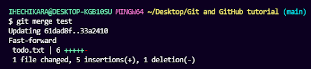

# A comprehensive guide to web development

This is a 'getting started' documentation for web development.

This document will provide a brief introduction to web development and technologies. By following through we intend to make you aware of several concepts related to web and internet while maintaining a simple language for everyone to comprehend.

## Chapters

1. [Introduction](#1-introduction)
2. [Basics](#2-basics)

    2.1 [HTML](#2.1-html)

    2.2 [CSS](#2.2-CSS)

    2.3 [JavaScript](#2.3-javascript)

    2.4 [Data Validation](#2.5-data-validation)

3. [Responsive Web Design](#3-responsive-web-design)

4. [Libraries](#4-libraries)

5. [Web Architecture](#5-web-architecture)

6. [Frontend](#6-frontend)

7. [Backend](#7-backend)

8. [Database](#8-database)

9. [Authentication and Authorization](#9-authentication-and-authorization)

10. [Git and Github](#10-git-and-github)

11. [Resources](#11-resources)

12. [Credits](#12-credits)

## 1. Introduction

Web development is the process of creating websites and web applications. Think of a website as a house, and web development as the construction process. Just as a house needs a blueprint and a team of builders, a website needs a design and a team of developers.

There are three main areas of web development: front-end, back-end, and full-stack.

Front-end development focuses on the parts of a website that users interact with, such as the layout, colors, fonts, and buttons. It involves using programming languages like HTML, CSS, and JavaScript to create the visual and interactive elements of a website. An example of front-end development would be designing a website's homepage to look visually appealing and user-friendly.

Back-end development focuses on the parts of a website that users don't see, such as the server and database that store and process data. It involves using programming languages like PHP, Python, and Ruby to create the logic and functionality that power a website. An example of back-end development would be creating a system that allows users to log in to a website and store their account information securely.

Full-stack development involves working on both the front-end and back-end of a website or application. This means that a full-stack developer can create both the visual and interactive parts of a website as well as the behind-the-scenes logic and functionality. An example of full-stack development would be building a website from scratch, starting with the design and layout, and then adding the necessary programming to make it work smoothly and securely.

## 2. Basics

### 2.1 HTML

HTML stands for "HyperText Markup Language," and it is used to create web pages. An HTML document is made up of a series of elements that define the structure and content of the page.

The basic structure of an HTML document looks like this:

```HTML
<!DOCTYPE html>
<html>
  <head>
    <title>Page Title</title>
  </head>
  <body>
    <h1>Heading 1</h1>
    <p>Paragraph text goes here.</p>
  </body>
</html>
```

Here's what each part of the structure does:

`<!DOCTYPE html>` - This is called a doctype declaration, and it tells the browser which version of HTML the page is using. In this case, it's HTML5.

`<html>` - This element is the root element of the page, and it contains all the other elements on the page.

`<head>` - This element contains information about the page that is not displayed to the user, such as the page title, metadata, and links to external resources.

`<title>` - This element is used to specify the title of the page, which is displayed in the browser's title bar.

`<body>` - This element contains all the visible content of the page, such as headings, paragraphs, images, and links.

`<h1>` - This is a heading element, and it is used to create a main heading for the page.

`<p>` - This is a paragraph element, and it is used to create blocks of text on the page.

That's a basic overview of the structure of an HTML document. Of course, there are many more elements and attributes you can use to create more complex pages we will now see the most commonly used ones:

Before we dive into commonly used HTML elements, let's first define what an attribute is.

In HTML, an attribute provides additional information about an element. Attributes are used to specify characteristics of an element, such as its size, color, position, or behavior. They can be added to any HTML element using the element's opening tag, and they are written as name-value pairs.

Here are some commonly applied attributes in HTML, along with their purposes:

### `id` attribute

The `id` attribute is used to uniquely identify an element on a web page. It is used to reference the element in CSS or JavaScript, making it easier to apply styles or behaviors to that specific element. The `id` attribute value should be unique on a page, meaning no two elements on the page should have the same `id` value.

Example:

```HTML
<div id="header">
  <h1>Welcome to my Website</h1>
</div>
```

### `class` attribute

The `class` attribute is used to identify a group of elements that share the same characteristics. It is used to apply a style or behavior to multiple elements at once. The `class` attribute value can be reused on different elements throughout the page.

Example:

```HTML
<div class="container">
  <h2 class="title">My Blog</h2>
  <p class="content">Lorem ipsum dolor sit amet, consectetur adipiscing elit.</p>
</div>
```

### `style` attribute

The `style` attribute is used to apply inline styles to an element. Inline styles override any styles applied to the element through CSS. The `style` attribute value should be a semicolon-separated list of CSS property-value pairs.

Example:

```HTML
<div style="background-color: #F0F0F0; color: #333; font-size: 18px;">
  <p>This text is styled inline.</p>
</div>
```

These attributes are commonly used to add structure, style, and behavior to HTML elements. Knowing how and when to use them can help you create well-organized and visually appealing web pages. <br>
<br>
<br>
Now Lets take a look at tags

### `<div>` tag

The HTML `<div>` tag is a very useful and flexible tag that allows you to group together other HTML elements and apply styles or JavaScript functions to them as a unit. It doesn't have any specific meaning on its own, but it acts as a container for other elements, which can be useful for organizing and structuring your code.

Here's an example of how you might use the `<div>` tag:

```HTML
<div class="container">
  <h1>Welcome to my website!</h1>
  <p>This is a paragraph of text.</p>
</div>
```

### `<p>` tag

The `<p>` tag in HTML is used to create a paragraph of text. It is an inline element, meaning it is typically used within block-level elements like `<div>` or `<section>` to separate text into paragraphs.

Here is an example of the `<p>` tag in use:

```HTML
<div>
  <p>This is a paragraph of text.</p>
  <p>This is another paragraph of text.</p>
</div>
```

In this example, two paragraphs of text are contained within a `<div>` element. Each paragraph is enclosed in its own set of `<p>` tags.

### `` tag

The `` tag in HTML is used to display an image on a web page. It is an empty element, meaning it does not require a closing tag. Instead, its properties are specified using attributes.

Here are some commonly used attributes of the `` tag:

- `src`: This attribute is used to specify the URL of the image file that should be displayed.

- `alt`: This attribute is used to provide alternative text for the image. The text will be displayed if the image cannot be loaded, or if the user is using a screen reader.

- `width` and `height`: These attributes are used to specify the width and height of the image, in pixels.

Here is an example of the `` tag in use:

```HTML

```

In this example, the `` tag displays an image of a puppy. The `src` attribute specifies the URL of the image file, while the `alt`, `width`, and `height` attributes provide additional information about the image.

### `<a>` tag

The `<a>` tag in HTML is used to create a hyperlink to another web page or resource. It can also be used to create links to email addresses or other types of files.

Here are some commonly used attributes of the `<a>` tag:

- `href`: This attribute is used to specify the URL of the web page or resource that the link should point to.

- `target`: This attribute is used to specify where the linked page should be displayed. For example, it can be set to "_blank" to open the linked page in a new browser tab or window.

- `title`: This attribute is used to provide additional information about the link. It is often displayed as a tooltip when the user hovers their mouse over the link.

Here is an example of the `<a>` tag in use:

```HTML
<a href="https://example.com" target="_blank" title="Visit Example.com">Visit Example.com</a>
```

In this example, the `<a>` tag creates a hyperlink to the website "example.com". The `href` attribute specifies the URL of the website, while the `target` attribute opens the website in a new browser tab or window. The `title` attribute provides additional information about the link.

### list tags

HTML provides three types of list tags: `<ul>`, `<ol>`, and `<li>`.

- The `<ul>` tag is used to create an unordered list. This means that the items in the list are not numbered, and are typically displayed with bullet points or some other type of symbol.

- The `<ol>` tag is used to create an ordered list. This means that the items in the list are numbered, starting from 1 by default.

- The `<li>` tag is used to create list items. Each individual item in a list should be wrapped in an `<li>` tag.

Here is an example of an unordered list:

```HTML
<ul>
  <li>Item 1</li>
  <li>Item 2</li>
  <li>Item 3</li>
</ul>
```

In this example, the `<ul>` tag creates an unordered list. Each individual list item is represented by an `<li>` tag.

Here is an example of an ordered list:

```HTML
<ol>
  <li>First item</li>
  <li>Second item</li>
  <li>Third item</li>
</ol>
```

In this example, the `<ol>` tag creates an ordered list. Each individual list item is represented by an `<li>` tag.

And finally, here is an example of nested lists:

```HTML
<ul>
  <li>Item 1
    <ul>
      <li>Sub-item 1</li>
      <li>Sub-item 2</li>
    </ul>
  </li>
  <li>Item 2</li>
  <li>Item 3</li>
</ul>
```

### `<script>` and `<style>` tags

HTML also provides `<script>` and `<style>` tags which are used to include scripts and styles in an HTML document.

- The `<script>` tag is used to include client-side scripts, typically JavaScript. The contents of this tag are executed by the client's web browser. The `src` attribute can be used to specify an external script file to include.

Here is an example of including a script in an HTML document:

```HTML
<script>
  function myFunction() {
    alert("Hello World!");
  }
</script>
```

In this example, the contents of the `<script>` tag define a JavaScript function. This function will be executed when called from other JavaScript code or from an HTML event attribute.

Here is an example of including an external script file:

```HTML
<script src="myscript.js"></script>
```

In this example, the `src` attribute is used to specify an external JavaScript file to include.

- The `<style>` tag is used to define styles for an HTML document. These styles can be used to control the appearance of elements on the page. The `type` attribute should be set to "text/css" to indicate that the contents of the tag are CSS code.

Here is an example of defining styles using a `<style>` tag:

```HTML
<style type="text/css">
  body {
    background-color: lightblue;
  }
  h1 {
    color: navy;
    font-size: 24px;
  }
</style>
```

In this example, the contents of the `<style>` tag define CSS styles for the `<body>` and `<h1>` elements.

### `<form>` tag

The `<form>` tag is used to create an HTML form for user input. The form can be used to submit data to a server for processing.

Here is an example of a simple form:

```HTML
<form action="/process-form" method="post">
  <label for="name">Name:</label>
  <input type="text" id="name" name="name">
  
  <label for="email">Email:</label>
  <input type="email" id="email" name="email">
  
  <input type="submit" value="Submit">
</form>
```

In this example, the form has an `action` attribute that specifies where the form data will be sent when it is submitted. The `method` attribute specifies whether the data should be submitted using the HTTP POST or GET method.

The form contains two input fields for the user to enter their name and email address. The `label` element is used to provide a description for each input field. The `for` attribute of the `label` element should match the `id` attribute of the corresponding input field.

The form also contains a submit button that the user can click to submit the form data to the server.

The example above is just a simple form. In practice, HTML forms can contain many different types of input fields and may be used for a wide variety of purposes.

### `<table>` tag

The `<table>` tag is used to create an HTML table.

Here is an example of a simple table:

``` html
<table>
  <thead>
    <tr>
      <th>Name</th>
      <th>Age</th>
      <th>Gender</th>
    </tr>
  </thead>
  <tbody>
    <tr>
      <td>John</td>
      <td>25</td>
      <td>Male</td>
    </tr>
    <tr>
      <td>Jane</td>
      <td>30</td>
      <td>Female</td>
    </tr>
    <tr>
      <td>Bob</td>
      <td>42</td>
      <td>Male</td>
    </tr>
  </tbody>
</table>
```

In this example, the `<table>` tag defines the beginning and end of the table. The `<thead>` tag is used to define the header section of the table, which contains the column headings. The `<tr>` tag is used to define each row of the table, and the `<th>` tag is used to define each cell of the header row.

The `<tbody>` tag is used to define the body section of the table, which contains the actual data. Each row of data is defined using the `<tr>` tag, and each cell of the row is defined using the `<td>` tag.

Additionally, the `<table>` tag can have several attributes to customize its appearance and behavior, including:

- `border`: Specifies the width of the border around the table. Default is 0.
- `cellpadding`: Specifies the amount of space between the cell content and the cell borders. Default is 1.
- `cellspacing`: Specifies the amount of space between cells. Default is 2.
- `width`: Specifies the width of the table in pixels or percentage.
- `height`: Specifies the height of the table in pixels or percentage.
- `align`: Specifies the horizontal alignment of the table within its container. Valid values are "left", "center", or "right".
- `bgcolor`: Specifies the background color of the table.

### 2.2 CSS

CSS is like the fashion designer of the internet world. It's the one that takes plain and boring web pages and makes them stylish and beautiful, just like how fashion designers transform plain fabrics into amazing clothing.

With CSS, you can add colors, fonts, images, and layouts to your website. It's like choosing the right accessories, shoes, and makeup to match your outfit. You can even make certain elements move, just like how models strut down the runway.

And just like how fashion designers have their own unique styles, you can customize your CSS to create a unique look and feel for your website. It's all about expressing yourself and making your website stand out from the crowd.

So if you want your website to look sharp, stylish, and fashionable, CSS is your go-to tool!

### Selectors

Selection by class, tag, and ID are three different ways of targeting specific elements in CSS.

Selection by class:
Classes are used to group elements that have something in common. To select an element with a particular class, you can use the class selector (`.`) followed by the class name.

Example:

```html
<div class="box">This is a box</div>
```

```css
.box {
  background-color: #ccc;
  padding: 10px;
}
```

In this example, we are targeting the element with class "box" and applying a gray background color and 10px padding.

Selection by tag:
Tags refer to the HTML tags that define elements on a web page. To select all elements of a particular tag, you can use the tag selector followed by the tag name.

Example:

```html
<h1>Header 1</h1>
<p>This is a paragraph</p>
```

```css
h1 {
  color: blue;
}

p {
  font-size: 16px;
}
```

In this example, we are targeting the `h1` and `p` tags and applying different styles to each. The `h1` tag will have blue text color, while the `p` tag will have a font size of 16px.

Selection by ID:
IDs are used to uniquely identify an element on a web page. To select an element with a particular ID, you can use the ID selector (`#`) followed by the ID name.

Example:

```html
<div id="header">This is the header</div>
```

```css
#header {
  background-color: #333;
  color: #fff;
  padding: 10px;
}
```

In this example, we are targeting the element with ID "header" and applying a black background color, white text color, and 10px padding.

### Descendant selector

Selecting the inner item of a selected item in CSS is known as a descendant selector. It allows you to target an element that is nested inside another element, and apply styles specifically to that inner element.

For example, let's say you have an HTML structure like this:

```html
<div class="outer">
  <h2>Heading</h2>
  <p>Paragraph</p>
</div>
```

If you want to style the `p` element specifically when it is inside the `div` element with class `outer`, you can use the descendant selector like this:

```css
.outer p {
  color: red;
}
```

This will apply the `color: red;` style only to the `p` element that is a descendant of the `div` element with class `outer`.

Another example, let's say you have an HTML structure like this:

```html
<ul>
  <li>List Item 1
    <ul>
      <li>Sub-Item 1</li>
      <li>Sub-Item 2</li>
    </ul>
  </li>
  <li>List Item 2</li>
</ul>
```

If you want to style the `li` elements that are nested inside the inner `ul` element, you can use the descendant selector like this:

```css
ul ul li {
  font-weight: bold;
}
```

This will apply the `font-weight: bold;` style only to the `li` elements that are descendants of the inner `ul` element.

### `display: flex`

`display: flex` is a value for the CSS `display` property that allows you to create flexible and responsive layouts. It works by setting a parent container as a flex container, which enables you to easily manipulate the layout and alignment of its child elements.

Here's a simple example of how to use `display: flex` to center a child element within a parent container:

```html
<div class="container">
  <div class="child">Hello World!</div>
</div>
```

```css
.container {
  display: flex;
  justify-content: center;
  align-items: center;
  height: 100vh;
}

.child {
  background-color: blue;
  color: white;
  padding: 10px;
}
```

In this example, `display: flex` is used to create a flex container for the parent `div` element with class `.container`. The `justify-content` and `align-items` properties are used to center the child element both horizontally and vertically. The child element itself has a blue background color, white text color, and some padding.

### `display: block`

`display: block` is a value for the CSS `display` property that is used to make an element behave as a block-level element. Block-level elements take up the full width of their parent container by default, and each element is placed on a new line.

Here's an example of how to use `display: block` to create a simple form:

```html
<form>
  <label for="name">Name:</label>
  <input type="text" id="name" name="name">
  <br>
  <label for="email">Email:</label>
  <input type="email" id="email" name="email">
  <br>
  <button type="submit">Submit</button>
</form>
```

```css
form {
  display: block;
}

label {
  display: block;
  margin-bottom: 10px;
}

input {
  display: block;
  width: 100%;
  padding: 5px;
  margin-bottom: 10px;
}

button {
  display: block;
  background-color: blue;
  color: white;
  padding: 10px;
  border: none;
  border-radius: 5px;
}
```

In this example, `display: block` is used to make each form element behave as a block-level element. The `label` elements are displayed as block-level elements with a bottom margin to create some space between each label and input. The `input` elements are also displayed as block-level elements with a width of 100% to fill the full width of their parent container. Finally, the `button` element is displayed as a block-level element and given some styling to make it stand out.

### `display: inline`

`display: inline` is a value for the CSS `display` property that is used to make an element behave as an inline-level element. Inline-level elements only take up as much width as they need to display their content, and multiple inline-level elements can appear on the same line.

Here's an example of how to use `display: inline` to create a simple navigation menu:

```
<nav>
  <a href="#">Home</a>
  <a href="#">About</a>
  <a href="#">Contact</a>
</nav>
```

```
nav {
  display: block;
}

a {
  display: inline;
  margin-right: 10px;
  text-decoration: none;
  color: blue;
}
```

In this example, `display: inline` is used to make the anchor elements (`<a>`) behave as inline-level elements so that they appear on the same line. The `margin-right` property is used to create some space between each link, and the `text-decoration` and `color` properties are used to style the links. The parent `nav` element is set to `display: block` to ensure that it takes up the full width of its parent container.

### `display: inline-block`

`display: inline-block` is a value for the CSS `display` property that combines the features of both `display: inline` and `display: block`. Elements with `display: inline-block` are similar to inline-level elements in that they take up only as much width as they need to display their content, but they can also have a fixed width, height, and padding, similar to block-level elements.

Here's an example of how to use `display: inline-block` to create a simple navigation menu with a fixed width and height:

```html
<nav>
  <a href="#">Home</a>
  <a href="#">About</a>
  <a href="#">Contact</a>
</nav>
```

```css
nav {
  display: block;
  width: 100%;
}

a {
  display: inline-block;
  width: 100px;
  height: 50px;
  padding: 10px;
  text-align: center;
  background-color: blue;
  color: white;
  text-decoration: none;
  border-radius: 5px;
  margin-right: 10px;
}
```

In this example, the `nav` element is displayed as a block-level element with a width of 100%. Each `a` element within the navigation menu is displayed as an inline-block element with a fixed width of 100px, a height of 50px, and some padding to create space around the text. The background color, text color, and other styling are added to make the navigation menu look more appealing. The `margin-right` property is used to create some space between each navigation link.

### Positioning

CSS Positioning allows you to control the position and layout of elements on your webpage. There are three commonly used position values: absolute, relative, and fixed.

### Relative

Relative positioning is the default positioning value for most HTML elements. With relative positioning, an element's position is based on its original position in the HTML document. So, if you add `position: relative` to an element and then use the `top`, `bottom`, `left`, or `right` properties to adjust its position, it will move relative to its original position. This means that other elements on the page will still flow around it, even if it's moved.

Here's an example:

```html
<!DOCTYPE html>
<html>
  <head>
    <style>
      .box {
        position: relative;
        left: 50px;
        top: 50px;
        background-color: blue;
        height: 100px;
        width: 100px;
      }
    </style>
  </head>
  <body>
    <div class="box"></div>
    <p>This is some text.</p>
  </body>
</html>
```

In this example, we have a `div` element with the class `box`. We've set its `position` to `relative`, which means that it will be positioned relative to its original position in the HTML document.

We've also set its `left` and `top` properties to `50px`, which means that it will move 50 pixels to the right and 50 pixels down from its original position.

The `background-color`, `height`, and `width` properties are just styling properties to give the box a blue background color and a height and width of 100 pixels.

Below the `div` element, we have a paragraph (`<p>`) element with some text in it. Since the `div` element has relative positioning, the paragraph element will flow around it, as if the `div` element were still in its original position.

### Absolute

With absolute positioning, an element's position is based on its closest positioned ancestor element. If an ancestor element is not positioned (i.e., it doesn't have a `position` property set to `relative`, `absolute`, or `fixed`), then the element will be positioned relative to the `html` element.

Here's an example:

```html
<!DOCTYPE html>
<html>
  <head>
    <style>
      .box {
        position: absolute;
        top: 50px;
        right: 50px;
        background-color: blue;
        height: 100px;
        width: 100px;
      }

      .container {
        position: relative;
        height: 200px;
        width: 200px;
        border: 1px solid black;
      }
    </style>
  </head>
  <body>
    <div class="container">
      <div class="box"></div>
    </div>
    <p>This is some text.</p>
  </body>
</html>
```

In this example, we have a `div` element with the class box. We've set its position to absolute, which means that it will be positioned relative to its closest positioned ancestor element.

The closest positioned ancestor element is the `div` element with the class container. We've set its `position` to `relative`, which means that it will be the closest positioned ancestor element for the `div` with class `box`. We've also set its `height`, `width`, and `border` properties to give it some dimensions and a visible border.

We've set the `top` and `right` properties of the `box` element to `50px`, which means that it will be positioned 50 pixels from the top of its closest positioned ancestor element (i.e., the top of the `container` element) and 50 pixels from the right of its closest positioned ancestor element (i.e., the right side of the `container` element).

The `background-color`, `height`, and `width` properties are just styling properties to give the box a blue background color and a height and `width` of 100 pixels.

Below the `div` element, we have a paragraph `<p>` element with some text in it. Since the `div` element with class `container` has relative positioning, the paragraph element will flow around it, as if the `div` element were still in its original position.

### Fixed

With `position: fixed`, an element is positioned relative to the viewport, which means that it will stay in the same position even if the page is scrolled.

Here's an example:

```html
<!DOCTYPE html>
<html>
  <head>
    <style>
      .box {
        position: fixed;
        top: 50px;
        right: 50px;
        background-color: blue;
        height: 100px;
        width: 100px;
      }
    </style>
  </head>
  <body>
    <div class="box"></div>
    <p>This is some text.</p>
  </body>
</html>
```

In this example, we have a `div` element with the class `box`. We've set its `position` to `fixed`, which means that it will be positioned relative to the viewport (i.e., the browser window), and will not move when the user scrolls the page.

We've set the `top` and `right` properties of the `box` element to `50px`, which means that it will be positioned 50 pixels from the top of the viewport and 50 pixels from the right of the viewport.

The `background-color`, `height`, and `width` properties are just styling properties to give the box a blue background color and a height and width of 100 pixels.

Below the `div` element, we have a paragraph (`<p>`) element with some text in it. Since the `div` element has fixed positioning, the paragraph element will flow behind it, as if the `div` element were not there at all.

### Padding and Margin

- `margin`: Margin refers to the space between an element and its neighboring elements. It is used to create space around an element and to separate it from other elements on the page. Margin is specified using the `margin` property, and you can set values for the top, right, bottom, and left margins individually, or use shorthand notation to set all four margins at once.

- `padding`: Padding refers to the space between an element's content and its border. It is used to create space within an element, and to separate the element's content from its border. Padding is specified using the `padding` property, and like `margin`, you can set values for the top, right, bottom, and left padding individually, or use shorthand notation to set all four paddings at once.

Here's an example of using `margin` and `padding` in CSS:

```html
<!DOCTYPE html>
<html>
  <head>
    <style>
      .box {
        margin: 20px;
        padding: 10px;
        background-color: blue;
        color: white;
      }
    </style>
  </head>
  <body>
    <div class="box">This is some text inside a box.</div>
  </body>
</html>
```

In this example, we have a `div` element with the class `box`. We've set its `margin` to `20px`, which creates a margin of 20 pixels around the entire box. We've set its `padding` to `10px`, which creates padding of 10 pixels between the content and the border of the box.

We've also set the `background-color` to blue and the `color` to white, so the text inside the box is white on a blue background.

I hope this example helps you understand how `margin` and `padding` work! Let me know if you have any other questions.

### `flex-column` and `flex-row`

- `flex-column`: `flex-column` is a value for the `flex-direction` property. It is used to create a vertical flex container, meaning that the flex items are laid out vertically from top to bottom. With `flex-column`, the main axis is vertical and the cross axis is horizontal.

- `flex-row`: `flex-row` is also a value for the `flex-direction` property. It is used to create a horizontal flex container, meaning that the flex items are laid out horizontally from left to right. With `flex-row`, the main axis is horizontal and the cross axis is vertical.

Here's an example of using `flex-column` and `flex-row` in CSS:

```html
<!DOCTYPE html>
<html>
  <head>
    <style>
      .container {
        display: flex;
        flex-direction: row; /* this could also be flex-row */
        justify-content: center;
        align-items: center;
        height: 300px;
        background-color: lightgray;
      }

      .item {
        width: 50px;
        height: 50px;
        margin: 10px;
        background-color: white;
      }
    </style>
  </head>
  <body>
    <h2>Flex Column</h2>
    <div class="container" style="flex-direction: column;">
      <div class="item"></div>
      <div class="item"></div>
      <div class="item"></div>
    </div>

    <h2>Flex Row</h2>
    <div class="container" style="flex-direction: row;">
      <div class="item"></div>
      <div class="item"></div>
      <div class="item"></div>
    </div>
  </body>
</html>
```

In this example, we have a `div` with the class `container` that has three child elements with the class `item`. We've set the `display` property of the `container` to `flex`, which creates a flex container, and we've set the `flex-direction` property to `row` for the first container and `column` for the second container.

We've also set the `justify-content` property to `center` and the `align-items` property to `center`, which centers the flex items both horizontally and vertically within the container.

Finally, we've given the `item` elements a width and height, some margin, and a white background color, so they're visible within the container.

I hope this example helps you understand how `flex-column` and `flex-row` work! Let me know if you have any other questions.

### Pseudo Elements

Pseudo-elements and pseudo-classes are CSS selectors that allow you to style specific parts of an HTML element.

Pseudo-elements are used to style a specific part of an element, such as the first line of text or the first letter of a paragraph. They are denoted by double colons (::) preceding the element name, and the most common ones are `::before` and `::after`. For example, you can use `::before` to add content before an element and `::after` to add content after an element.

Example:

```CSS
p::before {
  content: "Read this: ";
}
```

This will add the text "Read this: " before every paragraph on the page.

Pseudo-classes, on the other hand, are used to style an element based on its state, such as when the user hovers over it or clicks on it. They are denoted by a colon (:), and some of the most common ones are `:hover`, `:active`, `:focus`, and `:visited`.

Example:

```CSS
a:hover {
  color: red;
}
```

This will change the color of a hyperlink to red when the user hovers over it.

Combined, pseudo-elements and pseudo-classes can be used to create powerful and dynamic CSS effects that can enhance the user experience of a website.

### Media Query

Media queries are a powerful feature of CSS that allow you to apply different styles to your web page based on the size and characteristics of the device it is being viewed on. With media queries, you can make your web page look great on any device, from a small smartphone screen to a large desktop monitor.

Media queries are written using the `@media` rule, which has a similar syntax to other CSS rules. Inside the `@media` rule, you specify the conditions under which the styles inside the rule should be applied.

Here's an example of a media query that applies a different background color to the body element when the screen width is less than or equal to 768 pixels:

```CSS
@media (max-width: 768px) {
  body {
    background-color: lightblue;
  }
}
```

In this example, `(max-width: 768px)` is the condition that must be true for the styles inside the media query to be applied. In this case, the condition is that the maximum width of the viewport is 768 pixels or less. If this condition is true, then the styles inside the media query (which in this case apply a light blue background color to the body element) will be applied.

Media queries can be used to apply a wide range of styles to your web page based on the characteristics of the device it is being viewed on. For example, you can use media queries to adjust font sizes, hide or show certain elements, or change the layout of your page based on the screen size.

### 2.3 JavaScript

JavaScript is a programming language that was specifically designed to work with web browsers. It's often used to add interactivity to web pages, like animations, pop-up windows, and form validations. In simpler terms, it's the programming language that makes websites do things beyond just displaying text and images.

JavaScript is a crucial part of web development because it enables developers to create dynamic and interactive web pages that respond to user input in real-time. Without JavaScript, web pages would be static and unresponsive, requiring users to constantly refresh the page to see any changes.

JavaScript can also be used to create complex web applications, such as social media platforms, e-commerce sites, and online games. These types of applications require a lot of functionality and interactivity, and JavaScript provides the tools necessary to build them.

### Variable Declaration

In JavaScript, let, var, and const are all used to declare variables, which are used to store values that can be changed or manipulated within a program. However, each of these keywords has its own specific purpose and behavior.

### var

var was traditionally used to declare variables in JavaScript. However, since the introduction of let and const, var has fallen out of favor. One of the main differences between var and the other two keywords is that var has function-level scope, while let and const have block-level scope. This means that var declarations are accessible anywhere within the function they are declared in, while let and const declarations are only accessible within the block they are declared in (e.g., a loop or an if statement). Additionally, var allows for variable hoisting, meaning that a variable can be declared after it is used in the code.

example:

```Javascript
function exampleFunction() {
  var x = 1;
  if (true) {
    var x = 2;
    console.log(x); // Output: 2
  }
  console.log(x); // Output: 2
}

exampleFunction();
```

In this example, `var` is used to declare the variable `x`. The variable is declared at the function level and can be accessed anywhere within the function. In this case, `x` is reassigned a new value inside the `if` statement, and that value is also accessible outside of the `if` statement.

### let

let is used to declare variables that can be reassigned a new value. Unlike var, let does not allow for hoisting and has block-level scope. This means that a let declaration must come before the variable is used, and it can only be accessed within the block it is declared in.

example:

```Javascript
function exampleFunction() {
  let x = 1;
  if (true) {
    let x = 2;
    console.log(x); // Output: 2
  }
  console.log(x); // Output: 1
}

exampleFunction();
```

In this example, `let` is used to declare the variable `x`. The variable is declared at the block level and can only be accessed within the `if` statement. In this case, `x` is reassigned a new value inside the `if` statement, but that value is not accessible outside of the `if` statement.

### const

const is used to declare variables that cannot be reassigned a new value. Once a value is assigned to a const variable, it cannot be changed. Like let, const has block-level scope and does not allow for hoisting.

`const` example:

```javascript
function exampleFunction() {
  const x = 1;
  if (true) {
    const x = 2;
    console.log(x); // Output: 2
  }
  console.log(x); // Output: 1
}

exampleFunction();
```

In this example, `const` is used to declare the variable `x`. The variable is declared at the block level and can only be accessed within the `if` statement. However, unlike `let`, `const` cannot be reassigned a new value. In this case, `x` is assigned a value of `2` inside the `if` statement, but that value is not accessible outside of the `if` statement.

### Data Types in JavaScript

JavaScript is a dynamically typed language, which means that variables can hold values of different types. Here are the main data types in JavaScript:

- **String**: A string is a sequence of characters enclosed in single or double quotes. For example: `"Hello, world!"`.

- **Number**: A number can be an integer or a decimal, positive or negative. For example: `42`, `3.14`.

- **Boolean**: A boolean represents one of two values: `true` or `false`.

- **Undefined**: A variable that has not been assigned a value is undefined. For example: `let x; console.log(x); // Output: undefined`.

- **Null**: Null represents the intentional absence of any object value. For example: `let x = null; console.log(x); // Output: null`.

- **Object**: An object is a collection of properties, where each property has a key and a value. For example:

  ```javascript
  let person = {
    name: "John",
    age: 30,
    isStudent: true
  };
  ```

- **Array**: An array is a collection of values, where each value has an index. For example:

  ```javascript
  let fruits = ["apple", "banana", "orange"];
  ```

- **Function**: A function is a reusable block of code that performs a specific task. Functions can take parameters as input and return a value as output. For example:

  ```javascript
  function addNumbers(a, b) {
    return a + b;
  }
  ```

JavaScript also has a special data type called `Symbol`, which is used for creating unique identifiers.

### Coercion in JavaScript

Coercion is the process of converting a value from one type to another. In JavaScript, coercion can occur implicitly or explicitly.

- **Implicit coercion**: Implicit coercion occurs when JavaScript automatically converts a value from one type to another without the programmer's knowledge or consent. This can lead to unexpected behavior and bugs in code. For example:

  ```javascript
  console.log(5 + "5"); // Output: "55"
  console.log(true + true); // Output: 2
  ```

  In the first example, JavaScript coerces the number `5` into a string and concatenates it with the string `"5"`. In the second example, JavaScript coerces the booleans `true` into the number `1` and adds them together.

- **Explicit coercion**: Explicit coercion occurs when a programmer intentionally converts a value from one type to another using built-in functions or operators. This is typically done to ensure that the code behaves as expected. For example:

  ```javascript
  console.log(Number("5")); // Output: 5
  console.log(String(5)); // Output: "5"
  console.log(Boolean(0)); // Output: false
  ```

  In the first example, the `Number()` function explicitly coerces the string `"5"` into the number `5`. In the second example, the `String()` function explicitly coerces the number `5` into the string `"5"`. In the third example, the `Boolean()` function explicitly coerces the number `0` into the boolean `false`.

It's important to be aware of coercion in JavaScript and to use it intentionally and carefully to avoid unexpected behavior and bugs in code.

### Asynchronous Nature of JS

JavaScript is an asynchronous programming language, which means that code can run in the background without blocking other code from executing. This is achieved through the use of callbacks, promises, and async/await.

- **Callbacks**: A callback is a function that is passed as an argument to another function and is executed when the other function completes. Callbacks are commonly used for asynchronous operations, such as fetching data from a server or reading a file. For example:

  ```javascript
  function fetchData(callback) {
    setTimeout(() => {
      callback("Data fetched successfully!");
    }, 2000);
  }

  fetchData((data) => {
    console.log(data); // Output: "Data fetched successfully!"
  });
  ```

  In this example, the `fetchData()` function takes a callback function as an argument and simulates fetching data from a server using a `setTimeout()` function. The `fetchData()` function then executes the callback function with the fetched data as an argument.

- **Promises**: A promise is an object that represents the eventual completion or failure of an asynchronous operation and allows you to handle the result as either a success or failure. Promises are commonly used for asynchronous operations, such as fetching data from a server or reading a file. For example:

  ```javascript
  function fetchData() {
    return new Promise((resolve, reject) => {
      setTimeout(() => {
        resolve("Data fetched successfully!");
      }, 2000);
    });
  }

  fetchData()
    .then((data) => {
      console.log(data); // Output: "Data fetched successfully!"
    })
    .catch((error) => {
      console.error(error);
    });
  ```

  In this example, the `fetchData()` function returns a promise that simulates fetching data from a server using a `setTimeout()` function. The `fetchData()` function then resolves the promise with the fetched data, which can be handled using the `then()` method.

- **Async/await**: Async/await is a way to write asynchronous code that looks and behaves like synchronous code. Async/await is built on top of promises and allows you to write asynchronous code in a more readable and maintainable way. For example:

  ```javascript
  async function fetchData() {
    return new Promise((resolve, reject) => {
      setTimeout(() => {
        resolve("Data fetched successfully!");
      }, 2000);
    });
  }

  async function logData() {
    const data = await fetchData();
    console.log(data); // Output: "Data fetched successfully!"
  }

  logData();
  ```

  In this example, the `fetchData()` function returns a promise that simulates fetching data from a server using a `setTimeout()` function. The `logData()` function uses the `await` keyword to wait for the promise to resolve and then logs the fetched data to the console.

JavaScript's asynchronous nature is a powerful feature that allows developers to write complex applications that can handle multiple tasks simultaneously without blocking the main thread. However, it requires careful consideration and understanding of asynchronous programming concepts to avoid errors and unexpected behavior in code.

### Operators in JS

Operators are used to perform operations on values or variables in JavaScript. There are several types of operators in JavaScript, including arithmetic, assignment, comparison, logical, and bitwise operators.

- **Arithmetic operators**: Arithmetic operators are used to perform basic arithmetic operations, such as addition, subtraction, multiplication, and division. For example:

  ```javascript
  let a = 10;
  let b = 5;

  console.log(a + b); // Output: 15
  console.log(a - b); // Output: 5
  console.log(a * b); // Output: 50
  console.log(a / b); // Output: 2
  console.log(a % b); // Output: 0
  ```

  In this example, the `+`, `-`, `*`, `/`, and `%` operators are used to perform addition, subtraction, multiplication, division, and modulus operations, respectively.

- **Assignment operators**: Assignment operators are used to assign values to variables. For example:

  ```javascript
  let a = 10;
  let b = 5;

  a += b; // Equivalent to a = a + b;
  console.log(a); // Output: 15

  a -= b; // Equivalent to a = a - b;
  console.log(a); // Output: 10

  a *= b; // Equivalent to a = a * b;
  console.log(a); // Output: 50

  a /= b; // Equivalent to a = a / b;
  console.log(a); // Output: 10

  a %= b; // Equivalent to a = a % b;
  console.log(a); // Output: 0
  ```

  In this example, the `+=`, `-=`, `*=`, `/=`, and `%=` operators are used to assign values to the `a` variable using addition, subtraction, multiplication, division, and modulus operations, respectively.

- **Comparison operators**: Comparison operators are used to compare two values and return a Boolean value of `true` or `false`. For example:

  ```javascript
  let a = 10;
  let b = 5;

  console.log(a > b); // Output: true
  console.log(a >= b); // Output: true
  console.log(a < b); // Output: false
  console.log(a <= b); // Output: false
  console.log(a === b); // Output: false
  console.log(a !== b); // Output: true
  ```

  In this example, the `>`, `>=`, `<`, `<=`, `===`, and `!==` operators are used to compare the `a` and `b` variables and return `true` or `false` based on the comparison result.

- **Logical operators**: Logical operators are used to combine or invert Boolean values. For example:

  ```javascript
  let a = true;
  let b = false;

  console.log(a && b); // Output: false
  console.log(a || b); // Output: true
  console.log(!a); // Output: false
  console.log(!b); // Output: true
  ```

  In this example, the `&&`, `||`, and `!` operators are used to perform logical AND, logical OR, and logical NOT operations on the `a` and `b` Boolean values.

- **Bitwise operators**: Bitwise operators are used to perform operations on the binary representation of numbers. For example:

  ```javascript
  let a = 5; // Binary representation: 101
  let b = 3; // Binary representation: 011

  console.log(a & b); // Output: 1 (Binary representation: 001)
  console.log(a | b); // Output: 7 (Binary representation: 111)
  console.log(a ^ b); // Output: 6 (Binary representation: 110)
  console.log(~a); // Output: -6 (Binary representation: 111...110)
  console.log(a << 1); // Output: 10 (Binary representation: 1010)
  console.log(a >> 1); // Output: 2 (Binary representation: 010)
  console.log(a >>> 1); // Output: 2 (Binary representation: 010)
  ```

  In this example, the `&`, `|`, `^`, `~`, `<<`, `>>`, and `>>>` operators are used to perform bitwise AND, bitwise OR, bitwise XOR, bitwise NOT, left shift, right shift, and unsigned right shift operations on the `a` and `b` values.

- **Conditional (ternary) operator**: The conditional operator is a shorthand version of an if-else statement. It is often used to assign a value to a variable based on a condition. For example:

  ```javascript
  let a = 10;
  let b = 5;

  let result = a > b ? "a is greater than b" : "b is greater than or equal to a";
  console.log(result); // Output: "a is greater than b"
  ```

  In this example, the conditional operator `? :` is used to check if the value of `a` is greater than the value of `b`. If it is, the string `"a is greater than b"` is assigned to the `result` variable. Otherwise, the string `"b is greater than or equal to a"` is assigned to the `result` variable.

- **Comma operator**: The comma operator is used to evaluate two or more expressions and return the result of the last expression. For example:

  ```javascript
  let a = 10, b = 5;

  let result = (a += b, a - b);
  console.log(result); // Output: 10
  console.log(a); // Output: 15
  console.log(b); // Output: 5
  ```

  In this example, the comma operator is used to first assign the value of `a + b` to the `a` variable, and then subtract the value of `b` from the `a` variable. The final result of the expression `(a += b, a - b)` is the value of `a - b`, which is `10`.

JavaScript also has a few other operators, such as the `typeof` operator (used to check the type of a value or variable), the `delete` operator (used to delete a property from an object), and the `in` operator (used to check if a property exists in an object).

### Template Literal

- **Template literals**: Template literals are a new way to define strings in JavaScript. They allow you to embed expressions inside string literals, making it easier to build dynamic strings. To define a template literal, you enclose the string in backticks (`` ` ``) instead of quotes.

  For example:

  ```javascript
  let name = "John";
  let greeting = `Hello, ${name}!`;

  console.log(greeting); // Output: "Hello, John!"
  ```

  In this example, the `name` variable is embedded inside the `greeting` string using `${...}`. When the `console.log()` function is called, the value of `greeting` is printed to the console, with the value of `name` inserted in the appropriate location.

  You can also use template literals to create multi-line strings without using escape characters:

  ```javascript
  let multiLine = `This is
  a multi-line
  string.`;

  console.log(multiLine); // Output: "This is\na multi-line\nstring."
  ```

  In this example, the `multiLine` variable is assigned a multi-line string using backticks. The resulting string includes line breaks, which are automatically included in the final output when the string is printed to the console.

### Conditionals

- **Conditionals**: Conditionals are used to execute different code depending on whether a condition is true or false. In JavaScript, there are two types of conditionals: `if` statements and `switch` statements.

  - **`if` statements**: `if` statements are used to execute code if a condition is true. They have the following syntax:

    ```javascript
    if (condition) {
      // code to execute if condition is true
    } else {
      // code to execute if condition is false
    }
    ```

    For example:

    ```javascript
    let x = 5;

    if (x > 0) {
      console.log("x is positive");
    } else if (x < 0) {
      console.log("x is negative");
    } else {
      console.log("x is zero");
    }
    ```

    In this example, the `if` statement tests whether the value of `x` is greater than 0, and prints a message to the console depending on the result.

  - **`switch` statements**: `switch` statements are used to execute different code depending on the value of a variable or expression. They have the following syntax:

    ```javascript
    switch (expression) {
      case value1:
        // code to execute if expression === value1
        break;
      case value2:
        // code to execute if expression === value2
        break;
      // more cases...
      default:
        // code to execute if expression doesn't match any case
    }
    ```

    For example:

    ```javascript
    let day = "Monday";

    switch (day) {
      case "Monday":
        console.log("It's Monday");
        break;
      case "Tuesday":
        console.log("It's Tuesday");
        break;
      // more cases...
      default:
        console.log("It's another day");
    }
    ```

    In this example, the `switch` statement tests the value of the `day` variable and prints a message to the console depending on the result. If the value of `day` doesn't match any of the cases, the default case is executed.

### Functions

- **Functions**: Functions are blocks of code that can be called multiple times with different input parameters. They are defined using the `function` keyword, followed by a name for the function, a list of input parameters (also known as arguments), and the code block that makes up the body of the function.

  For example:

  ```javascript
  function add(a, b) {
    return a + b;
  }

  let sum = add(2, 3);
  console.log(sum); // Output: 5
  ```

  In this example, the `add()` function takes two arguments `a` and `b`, and returns their sum.

- **Fat arrow functions**: Fat arrow functions (also known as arrow functions) are a shorthand way of defining functions in JavaScript. They use the `=>` operator instead of the `function` keyword, and don't require a separate `return` statement when returning a value.

  For example:

  ```javascript
  let multiply = (a, b) => a * b;

  let product = multiply(2, 3);
  console.log(product); // Output: 6
  ```

  In this example, the `multiply` variable is assigned an arrow function that takes two arguments `a` and `b`, and returns their product. Since the function body is a single expression, it is implicitly returned without the need for a `return` statement.

  Arrow functions also have some other features, such as implicit binding of `this` and support for concise syntax for certain function bodies. Here is an example of an arrow function with concise syntax:

  ```javascript
  let numbers = [1, 2, 3, 4, 5];

  let squared = numbers.map(n => n * n);

  console.log(squared); // Output: [1, 4, 9, 16, 25]
  ```

  In this example, the `map()` method is used to transform an array of numbers by squaring each number. The callback function passed to `map()` is an arrow function with concise syntax, which takes a single argument `n` and returns its square.

### Loops

- **Loops**: Loops are used to execute a block of code repeatedly. In JavaScript, there are three types of loops: `for` loops, `while` loops, and `do-while` loops.

  - **`for` loops**: `for` loops are used to execute a block of code a specific number of times. They have the following syntax:

    ```javascript
    for (initialization; condition; increment/decrement) {
      // code to execute
    }
    ```

    For example:

    ```javascript
    for (let i = 0; i < 5; i++) {
      console.log(i);
    }
    ```

    In this example, the `for` loop executes the code block 5 times, with `i` taking on the values from 0 to 4.

  - **`while` loops**: `while` loops are used to execute a block of code while a condition is true. They have the following syntax:

    ```javascript
    while (condition) {
      // code to execute
    }
    ```

    For example:

    ```javascript
    let i = 0;

    while (i < 5) {
      console.log(i);
      i++;
    }
    ```

    In this example, the `while` loop executes the code block as long as `i` is less than 5, with `i` taking on the values from 0 to 4.

  - **`do-while` loops**: `do-while` loops are similar to `while` loops, but they execute the code block at least once, even if the condition is false. They have the following syntax:

    ```javascript
    do {
      // code to execute
    } while (condition);
    ```

    For example:

    ```javascript
    let i = 0;

    do {
      console.log(i);
      i++;
    } while (i < 5);
    ```

    In this example, the `do-while` loop executes the code block at least once, and then continues to execute it as long as `i` is less than 5.

### Error Handling

- **`try`-`catch`**: `try`-`catch` statements are used for error handling in JavaScript. The `try` block contains the code that might throw an exception, and the `catch` block contains the code that handles the exception if one is thrown.

  - **`try` block**: The `try` block contains the code that might throw an exception. It has the following syntax:

    ```javascript
    try {
      // code that might throw an exception
    } catch (error) {
      // code to handle the exception
    }
    ```

    For example:

    ```javascript
    try {
      const result = 10 / 0;
      console.log(result);
    } catch (error) {
      console.log(`An error occurred: ${error}`);
    }
    ```

    In this example, the `try` block attempts to divide 10 by 0, which is not allowed in JavaScript and will throw an exception. The `catch` block catches the exception and logs an error message to the console.

  - **`catch` block**: The `catch` block contains the code that handles the exception if one is thrown. It has the following syntax:

    ```javascript
    catch (error) {
      // code to handle the exception
    }
    ```

    The `error` parameter contains information about the exception that was thrown, including the name of the exception and a message describing the error.

  - **`finally` block**: Optionally, you can include a `finally` block that will execute regardless of whether an exception was thrown or not. The `finally` block has the following syntax:

    ```javascript
    finally {
      // code to execute
    }
    ```

    For example:

    ```javascript
    try {
      const result = 10 / 0;
      console.log(result);
    } catch (error) {
      console.log(`An error occurred: ${error}`);
    } finally {
      console.log("This code always runs");
    }
    ```

    In this example, the `finally` block logs a message to the console after the `try`-`catch` block has finished executing, regardless of whether an exception was thrown or not.

### DOM

- Document Object Model (DOM): The Document Object Model (DOM) is a programming interface for web documents. It represents the page so that programs can change the document structure, style, and content. Essentially, it is an API that allows JavaScript to interact with HTML and CSS.

- **What is the DOM?**: The DOM is a tree-like structure that represents the elements and content of an HTML or XML document. Each element in the document is represented by a node in the tree, and nodes can have child nodes and/or parent nodes. The topmost node in the tree is the document node, which represents the entire HTML or XML document.

- **How to access the DOM**: In JavaScript, the DOM can be accessed through the global `document` object, which represents the current web page as a `document` object. The `document` object has many methods and properties that can be used to manipulate the DOM, such as `getElementById()`, `querySelector()`, `createElement()`, `appendChild()`, and many more.

- **Manipulating the DOM**: Once you have accessed an element in the DOM, you can manipulate it using its properties and methods. For example, you can change the text content of an element by setting its `textContent` property, or you can add a new element to the DOM using the `createElement()` and `appendChild()` methods.

- **Events and the DOM**: In addition to manipulating the DOM, you can also listen for events that occur on elements in the DOM, such as clicks, mouse movements, and key presses. To do this, you can use the `addEventListener()` method, which allows you to specify a function to be called when the event occurs.

- **Browser compatibility**: It's important to note that different web browsers may have different implementations of the DOM, which can lead to inconsistencies in how JavaScript interacts with the DOM. To ensure cross-browser compatibility, it's a good idea to test your code in multiple web browsers and to use libraries like jQuery that provide a consistent API for interacting with the DOM.

### Accessing elements in DOM

- `getElementById`: This method returns the element that has the specified ID. It has the following syntax:

  ```javascript
  document.getElementById(id)
  ```

  For example:

  ```javascript
  const element = document.getElementById("myElement");
  ```

- `getElementsByClassName`: This method returns a collection of elements that have the specified class name. It has the following syntax:

  ```javascript
  document.getElementsByClassName(className)
  ```

  For example:

  ```javascript
  const elements = document.getElementsByClassName("myClass");
  ```

- `getElementsByTagName`: This method returns a collection of elements that have the specified tag name. It has the following syntax:

  ```javascript
  document.getElementsByTagName(tagName)
  ```

  For example:

  ```javascript
  const elements = document.getElementsByTagName("div");
  ```

- `getElementsByName`: This method returns a collection of elements that have the specified name attribute. It has the following syntax:

  ```javascript
  document.getElementsByName(name)
  ```

  For example:

  ```javascript
  const elements = document.getElementsByName("myName");
  ```

- `querySelector`: This method returns the first element that matches a specified CSS selector. It has the following syntax:

  ```javascript
  document.querySelector(selector)
  ```

  For example:

  ```javascript
  const element = document.querySelector("#myId .myClass");
  ```

- `querySelectorAll`: This method returns a collection of elements that match a specified CSS selector. It has the following syntax:

  ```javascript
  document.querySelectorAll(selector)
  ```

  For example:

  ```javascript
  const elements = document.querySelectorAll(".myClass");
  ```

These methods are used to retrieve elements from the HTML document so that you can interact with them through JavaScript. Each method has its own syntax and usage, depending on the criteria you want to use to select the elements.

### HTML on attribute

The `on` attribute in HTML is used to attach an event handler directly to an HTML element. It specifies the name of the event to listen for and the JavaScript code to execute when the event is triggered. For example, you can use the `onmouseover` attribute to listen for the mouseover event on an element and execute some JavaScript code when the event occurs.

Here's an example:

```html
<button onclick="alert('Button clicked!')">Click me</button>
```

In this example, the `onclick` attribute is used to add a click event handler to a button element. When the button is clicked, the JavaScript code `alert('Button clicked!')` is executed.

While the `on` attribute can be a quick and easy way to add interactivity to a web page, it has some limitations. One limitation is that you can only attach one event handler per `on` attribute. If you need to attach multiple event handlers to an element, you'll need to use the `addEventListener()` method in JavaScript instead.

Here's an example of using `addEventListener()` to attach a click event handler to a button element:

```html
<button id="myButton">Click me</button>

<script>
const button = document.getElementById('myButton');
button.addEventListener('click', () => {
  alert('Button clicked!');
});
</script>
```

In this example, the `addEventListener()` method is used to add a click event handler to the button element with the ID `myButton`. When the button is clicked, the function passed as the second argument to `addEventListener()` is executed. In this case, the function simply shows an alert box with the message "Button clicked!".

Using `addEventListener()` instead of the `on` attribute provides more flexibility and separation of concerns. You can keep your HTML code clean and free of JavaScript code, which can make it easier to maintain and update your web pages. Additionally, you can attach multiple event handlers to an element and remove them if needed.

Overall, the `on` attribute in HTML is a simple way to add interactivity to web pages, but for more complex interactions and better separation of concerns, it's best to use JavaScript and the `addEventListener()` method instead.

### Event Listeners

Event listeners are functions that are executed in response to a specific event occurring on an HTML element. They are used to add interactivity to web pages, such as responding to button clicks or keyboard inputs. In JavaScript, you can add an event listener to an element using the `addEventListener()` method.

The `addEventListener()` method takes two parameters: the type of event to listen for, and the function to execute when the event is triggered. Here's an example that adds an event listener to a button element:

```javascript
const button = document.querySelector('button');
button.addEventListener('click', () => {
  console.log('Button clicked!');
});
```

In this example, the `addEventListener()` method is used to add a click event listener to a button element. When the button is clicked, the function passed as the second parameter to `addEventListener()` is executed. In this case, the function simply logs a message to the console.

Here are a few more examples of event listeners:

- **Mouseover event listener**

  This event is triggered when the mouse pointer enters the area over an element.

  ```javascript
  const element = document.querySelector('.my-element');
  element.addEventListener('mouseover', () => {
    console.log('Mouse over!');
  });
  ```

- **Keydown event listener**

  This event is triggered when a key on the keyboard is pressed.

  ```javascript
  const input = document.querySelector('.my-input');
  input.addEventListener('keydown', () => {
    console.log('Key down!');
  });
  ```

- **Submit event listener**

  This event is triggered when a form is submitted.

  ```javascript
  const form = document.querySelector('.my-form');
  form.addEventListener('submit', (event) => {
    event.preventDefault();
    console.log('Form submitted!');
  });
  ```

In this last example, the `preventDefault()` method is used to prevent the form from being submitted in the usual way. Instead, the function passed to `addEventListener()` logs a message to the console.

### 2.5 Data Validation

## Data Validation in Web Applications

Data validation is the process of ensuring that the data entered by the user is valid and meets the requirements of the application. This is a crucial step in web development as it helps to prevent errors and security vulnerabilities.

There are several ways to perform data validation in web applications, including:

1. Client-side validation: This involves validating the data on the client-side using JavaScript before it is submitted to the server. This can provide immediate feedback to the user if they have entered invalid data, and can help to reduce the number of requests sent to the server.

2. Server-side validation: This involves validating the data on the server-side after it has been submitted by the user. This is important as it provides an additional layer of security and ensures that the data is validated even if the client-side validation fails or is bypassed.

3. Database validation: This involves validating the data at the database level, either through constraints or triggers. This can help to ensure that the data is consistent and valid across all parts of the application.

It is important to use a combination of these validation techniques to ensure that the data is as secure and valid as possible. Additionally, it is important to provide clear feedback to the user when invalid data is entered, so that they can correct the issue and resubmit the form.

Here's an example of client-side validation using JavaScript to ensure that a form field is not empty:

```javascript
const form = document.querySelector('form');
const input = document.querySelector('input');
const error = document.querySelector('.error');

form.addEventListener('submit', (event) => {
  if (input.value.trim() === '') {
    event.preventDefault();
    error.textContent = 'Please enter a value';
  }
});
```

In this example, we select the form, input field, and error element using the `document.querySelector()` method. We then add an event listener to the form's `submit` event, and check if the input value is empty using the `trim()` method to remove any leading or trailing whitespace. If the input value is empty, we prevent the form from submitting using the `preventDefault()` method, and display an error message to the user.
  
Here's an example of server-side validation using node.js to ensure that a data is present:

```javascript
app.post('/submit-form', (req, res) => {
  const { name, email } = req.body;
  if (!name || !email) {
    return res.status(400).send('Name and email are required');
  }
  // Process the data
  // ...
  return res.status(200).send('Data submitted successfully');
});
```

In the example above, the server checks if the `name` and `email` fields are present in the submitted data. If they are not present, it returns a `400 Bad Request` status code with an error message.

Here's an example of database constraints

```sql
CREATE TABLE users (
  id INT PRIMARY KEY,
  name VARCHAR(50) NOT NULL,
  email VARCHAR(100) NOT NULL UNIQUE
);
```

In the example above, the `NOT NULL` constraint ensures that both the `name` and `email` fields are required, while the `UNIQUE` constraint ensures that no two users can have the same email address.

By using a combination of these techniques, web developers can ensure that the user input is validated and meets the expected format before it is processed by the application.

## 3. Responsive Web Design

Responsive web design is an approach to web development that ensures that websites look great and function well on any device, regardless of its size or screen resolution.

The idea behind responsive web design is that instead of creating separate versions of a website for each device, developers create a single website that can adapt and adjust its layout and content according to the screen size of the device it's being viewed on.

Responsive design typically involves the use of flexible grid layouts, flexible images and media, and CSS media queries. A flexible grid layout ensures that website content can be easily rearranged and resized to fit different screen sizes. Flexible images and media ensure that images and videos can be scaled down to fit smaller screens without losing their quality. CSS media queries are used to apply different styles and rules to a website based on the screen size and device being used to view it.

By using responsive web design, developers can ensure that their websites are accessible and usable on any device, which can greatly improve the user experience and increase engagement and conversions. Additionally, responsive design can also benefit search engine optimization (SEO), as it makes it easier for search engines to crawl and index a website's content across different devices and screen sizes.

Here's an example of a simple responsive web design using HTML and CSS:

```html
<!DOCTYPE html>
<html>
<head>
  <title>Responsive Web Design Example</title>
  <meta name="viewport" content="width=device-width, initial-scale=1">
  <style>
    /* Desktop styles */
    .container {
      width: 960px;
      margin: 0 auto;
    }
    .box {
      width: 300px;
      height: 300px;
      background-color: #ccc;
      float: left;
      margin: 10px;
    }

    /* Tablet styles */
    @media (max-width: 768px) {
      .container {
        width: 100%;
      }
      .box {
        width: 48%;
        margin: 1%;
      }
    }

    /* Mobile styles */
    @media (max-width: 480px) {
      .box {
        width: 100%;
        margin: 2% 0;
      }
    }
  </style>
</head>
<body>
  <div class="container">
    <div class="box"></div>
    <div class="box"></div>
    <div class="box"></div>
    <div class="box"></div>
  </div>
</body>
</html>
```

In the example above, the CSS media queries are used to apply different styles based on the screen size. The `max-width` values for the media queries specify the maximum screen width at which the styles should be applied.

The desktop styles are defined outside of any media queries, and apply by default. The tablet styles are defined within a media query that applies when the screen width is less than or equal to 768px. The mobile styles are defined within a media query that applies when the screen width is less than or equal to 480px.

This approach allows the layout and styles of the website to adjust and optimize for different screen sizes and device types, providing a better user experience for all visitors.

## 4. Libraries

JavaScript libraries are collections of pre-written code that developers can use to simplify and speed up the process of building web applications. They typically provide a set of functions and methods that can be called from within a JavaScript program to perform common tasks such as working with the DOM, handling events, and making AJAX requests.

Using a JavaScript library can be a huge time saver, as it allows developers to avoid writing a lot of boilerplate code and focus on the specific functionality that they need to implement. Some popular JavaScript libraries include jQuery, Bootstrap etc.

### JQuery

jQuery is a popular JavaScript library that provides a wide range of functions and utilities for working with the DOM, handling events, making AJAX requests, and more. It's designed to simplify the process of writing JavaScript code and provide a consistent, cross-browser-compatible API.

One of the key features of jQuery is its ability to select and manipulate elements in the DOM. Here's an example of how you might use jQuery to select an element by its ID and change its text content:

```javascript
// Select an element by its ID and change its text content
$('#my-element').text('Hello, world!');
```

In this code, the `$` function provided by jQuery is used to select an element with the ID "my-element". The `text` method is then called on that element to change its text content to "Hello, world!".

jQuery also provides a range of event handling functions that make it easy to attach event listeners to DOM elements. Here's an example of how you might use jQuery to attach a click event listener to a button element:

```javascript
// Attach a click event listener to a button element
$('#my-button').click(function() {
  alert('Button clicked!');
});
```

In this code, the `$` function is used to select a button element with the ID "my-button". The `click` method is then called on that element to attach a click event listener. When the button is clicked, the function passed as an argument to `click` will be executed, in this case displaying an alert with the message "Button clicked!".

jQuery also makes it easy to make AJAX requests and handle the responses using its `$.ajax` function. Here's an example of how you might use `$.ajax` to make a GET request and handle the response:

```javascript
// Make a GET request to an API and handle the response
$.ajax({
  url: 'https://api.example.com/data',
  method: 'GET',
  success: function(response) {
    console.log('Data received:', response);
  },
  error: function(xhr, status, error) {
    console.error('Error:', error);
  }
});
```

In this code, the `$.ajax` function is used to make a GET request to an API endpoint. The `url` and `method` options are used to specify the URL and HTTP method for the request, respectively. The `success` option is used to specify a function to be called when the request is successful, and the `error` option is used to specify a function to be called when there's an error. In this case, the success function logs the response data to the console, and the error function logs any errors that occur.

These are just a few examples of the many things that can be done with jQuery. By providing a consistent and easy-to-use API, jQuery can simplify and speed up the process of building complex web applications.

### Bootstrap

Bootstrap is a popular CSS framework that makes it easy to create responsive and mobile-first websites. It includes a variety of CSS and JavaScript components, such as forms, buttons, navigation, and more. Here's an example of how to use Bootstrap to create a simple webpage:

```html
<!DOCTYPE html>
<html lang="en">
<head>
  <meta charset="UTF-8">
  <title>My Bootstrap Page</title>
  <!-- Include Bootstrap CSS -->
  <link rel="stylesheet" href="https://stackpath.bootstrapcdn.com/bootstrap/4.5.2/css/bootstrap.min.css">
</head>
<body>
  <div class="container">
    <h1>Welcome to my Bootstrap page!</h1>
    <p>This is some text using Bootstrap styles.</p>
    <button class="btn btn-primary">Click me!</button>
  </div>
  <!-- Include Bootstrap JS -->
  <script src="https://code.jquery.com/jquery-3.5.1.slim.min.js"></script>
  <script src="https://cdn.jsdelivr.net/npm/@popperjs/core@2.9.3/dist/umd/popper.min.js" integrity="sha384-REt0zv7QIg/M12YUMtVY0jLf5FJc5C5j5ywhbMYy95/DqokPbWAFmz5xsURBDll+" crossorigin="anonymous"></script>
  <script src="https://stackpath.bootstrapcdn.com/bootstrap/4.5.2/js/bootstrap.min.js"></script>
</body>
</html>
```

In this example, we're including the Bootstrap CSS and JS files from a CDN, and then using Bootstrap classes to style our HTML elements. We're also using Bootstrap's JavaScript components, such as the button component.

Bootstrap is a powerful tool that can help you create professional-looking websites quickly and easily. However, it's important to note that using a framework like Bootstrap does come with some trade-offs, such as potentially larger file sizes and less flexibility in design.

## 5. Web Architecture

Web architecture refers to the underlying structure and organization of web-based systems and applications. It includes the technologies, protocols, and standards used to build, communicate, and interact with web-based resources such as websites, web applications, and web services.

At a high level, web architecture can be thought of as consisting of three primary components: client, server, and network. The client is typically a web browser or other application that requests resources from a server. The server is a computer system that responds to client requests by serving up web pages or other content. The network is the infrastructure that connects clients and servers together, allowing them to communicate.

One common example of web architecture is the classic client-server model. In this model, a web browser (the client) sends a request to a web server for a web page or other resource. The server processes the request and sends back a response, which the client then displays to the user. The two communicate using the HTTP protocol, which is a set of rules for transmitting data over the web.

Web architecture also encompasses various other technologies and standards, such as HTML (Hypertext Markup Language) for structuring web content, CSS (Cascading Style Sheets) for styling web pages, and JavaScript for adding interactivity to web applications. In addition, there are numerous web frameworks and libraries available that can simplify web development and make it more efficient.

## 6. Frontend

Front-end web development is the development of the graphical user interface of a website. The frontend is where the design comes to life in a beautiful combination of HTML, CSS, and JavaScript.

Frontend is not only about making a user interface, but it is also about User experience. Frontend deals with presentation and making an interface that attracts users while maintaining utility.

Frontend can be looked at in two parts:

1. User expeirence/design:

    The design of a frontend application is just as important as any other part. Without a good design any application will look dull. A good design should be interactive, should use appropriate animations and make proper use of fonts and colors. There are many more aspets to user experience one can think of.

2. User Interface:

    The user interface is the part of the frontend that is interactable such as buttons, textbox, etc. It deals with handling the data in the application. It decides and defines actions performed based on an event. A simple example of this would be clicking a button to change theme.

A frontend application has another very important task:- Talking to the backend and manupilating data using APIs.

### Frontend Frameworks

Front-end frameworks have been gaining popularity in recent years as web development has become more complex and demanding. These frameworks offer a set of tools and conventions for building user interfaces and interactive web applications, allowing developers to work more efficiently and effectively.

A front-end framework is a collection of pre-built and reusable tools, libraries, and technologies used to facilitate the creation of consistent and visually appealing user interfaces for web applications.

These frameworks include various features such as pre-designed UI components, responsive layouts, and CSS styling, which help developers to create web applications with minimal effort and time.

Some popular front-end frameworks include React, Angular, Vue.js and Materialize. These frameworks provide developers with a set of tools that enable them to focus on writing application logic rather than reinventing the wheel with respect to the user interface.

A frontend framework makes managing a user interface easy. It helps by encapsulating components with the help of functions and classes.

These functions and classes makes it easier to reuse code properly without worrying of clashing of variables or creating redundancy.

### Examples of frameworks

Angular, React, and Vue is three of the most popular front-end frameworks used in modern web development. While they have many similarities, they also have some key differences that set them apart.

Lets take a look at these frameworks:

1. Angular:

    Angular is a full-fledged front-end framework developed by Google. It is a complete set of tools and features for building large-scale applications.

- It has a steep learning curve due to complex architecture and dependency injection
- It is a full-fledged framework with a complete set of tools and features for building large-scale applications
- It has very good performance
- It has large community support, but has decreased in recent years
- It uses a template-based approach for defining the UI

2. Vue:

    Vue is a lightweight front-end framework that focuses on the view layer. It has gained popularity in recent years due to its simplicity and ease of use.

- It is easy to learn and understand with a simple template syntax
- It is a lightweight framework that focuses on the view layer
- It gives good performance
- It has a strong community support, but smaller than React
- It uses a hybrid development approach that combines the template syntax with a reactive data-binding system

3. React:

    React is a library for building user interfaces. It is developed by Facebook and is known for its component-based approach and high performance.

- It has a moderate learning curve, especially for developers already familiar with JavaScript
- It is a library with a component-based approach and a focus on performance
- It is fastest among the three frameworks in terms of performance
- It has the largest community support among the three frameworks
- It uses a component-based approach for breaking down the UI into reusable components

## 7. Backend

### What is backend, why is it required?

The term backend typically refers to the part of an application that handles the logic and data processing behind the scenes. This includes things like database management, server-side scripting etc.
A backend is required in many applications because it handles the logic and processing that is necessary to provide a complete and functional user experience. Here are a few examples of why a backend is needed in different types of applications:

1. E-commerce website: An e-commerce website requires a backend to handle the processing of orders, inventory management, and payment processing. When a user places an order on the website, the backend must manage the inventory to ensure that the product is available, process the payment securely, and generate an order confirmation for the user.

2. Social media platform: A social media platform requires a backend to manage user profiles, posts, and interactions. When a user creates a post, the backend must store the content and metadata associated with the post, and make it available to other users who have permission to view it.

3. Mobile app: A mobile app requires a backend to handle data synchronization, user authentication, and storage of user preferences. When a user uses a mobile app, the backend must ensure that the user's data is synchronized across devices, verify the user's identity, and store user preferences so they are available the next time the user uses the app.

### Let us understand how it works and how frontend interacts with backend

Before we do we need to see what HTTP methods are:
HTTP methods are a way for clients (such as web browsers) and servers to communicate with each other over the internet. HTTP stands for Hypertext Transfer Protocol, which is the protocol used for transmitting data over the web.

There are several HTTP methods, also known as HTTP verbs, that are used for different types of requests:

1. GET: Used to retrieve information from a server. When a user visits a website, their web browser sends a GET request to the server to retrieve the webpage.

2. POST: Used to submit information to a server, such as when filling out a form. When a user submits a form on a website, their web browser sends a POST request to the server with the form data.

3. PUT: Used to update or replace existing information on a server. For example, a PUT request could be used to update a user's profile information.

4. DELETE: Used to delete information from a server. For example, a DELETE request could be used to delete a user's account.

5. PATCH: Used to make a partial update to existing information on a server. For example, a PATCH request could be used to update only a specific field in a user's profile.

6. HEAD: Similar to a GET request, but only retrieves the headers of the response, not the body.

A sample http request will look like this

``` http
GET /example.html HTTP/1.1
Host: www.example.com
User-Agent: Mozilla/5.0 (Windows NT 10.0; Win64; x64) AppleWebKit/537.36 (KHTML, like Gecko) Chrome/80.0.3987.132 Safari/537.36
Accept: text/html,application/xhtml+xml,application/xml;q=0.9,image/webp,image/apng,*/*;q=0.8,application/signed-exchange;v=b3;q=0.9
```

Here first line is the method and url, the url is relative.

Next few values such as Host, User-Agent etc are the headers, headers are used to pass additional information and configuration data.

### Lets see how a backend looks like in terms of a program

Without going to a specific language here is a pseudocode for a simple backend. It represenents the common structure of popular backend technology.

```bash
server = CreateServer()

server.handle(/, handleindex)

function handleindex(request, response){
 response.send(index.html)
} 

Server.listen()
```

Every server starts with initialization, in the above example `createServer` is the function that creates the server object

`Server.handle` is the function that binds the path "/" of the URL to the given function, here it is the `handleindex` function

Whenever someone will visit the path "/" the server will run the `handleindex` function.

This function receives two parameters
`request` and `response`

`request` is the request object which will contain information such as body, method, headers etc

This is where data sent from a frontend is found

`response` is the response object that function will send. We can put data and other fields in response and send it back to the frontend that calls the request.

Here we are sending index.html file to the frontend through response.

You may have guessed by now that this request is called by user webpage through browser hence, we send/render the html file.

GET method is usually used to request data from the server, GET is not very secure since the values passed through GET are visible in URL, example:
<http://example.com/search?q=hello>

Here q is passed to the server with value hello this is visible in URL, GET should never be used to send sensitive data.

It is used to request for data and information passed through GET should only be related to the data that is being retrieved.

POST,PUT and DELETE are typically used to send data to the server, neither of these methods show data in the URL but that does not make them secure automatically, one can still see the request body and find sensitive information.

You should always use HTTPS when sending sensitive information like passwords, keys etc.

APIs:
APIs stand for application programming interface. In simple terms it means that an API is a function or in case of web a URL that is used to communicate with applications.

A simple example of API in case of web is as follows:

<https://www.example.com/users>

This URL is an API. Which means that if we send a GET request then the server handling the URL will send back data to us.

Similarly if we send a POST request to that URL it will do some different action.

### RESTful APIs

REST stands for REpresentational State Transfer

REST is a design principle which states that a server should make use of 4 http methods for 4 purposes as follows:

1. GET: For retrieval of data
2. POST: To create new object or to add new data to the server
3. PUT/PATCH: To update data on the server
4. DELETE: To remove data from the server

REST is not just these 4 methods there are other principles that come within REST design.
(see <https://restfulapi.net/>).

REST APIs are widely used for building web and mobile applications, as well as integrating different software systems.
They provide a flexible and scalable way to transfer data between applications, making it easier to build complex systems and enable new types of interactions between different parts of an application or between different applications.

### What are some of the most popular backend languages?

There are many but lets take a brief look at a few:

1. **Nodejs**:
NodeJs is a backend programming language that is based on JavaScript. It's used for creating web applications and server-side code. NodeJs is known for its fast performance, scalability, and non-blocking I/O operations. It's commonly used for creating real-time applications, such as chat applications, gaming platforms, and social media platforms.

2. **Python**:
Python is a versatile programming language that is used for web development, scientific computing, data analysis, and machine learning. Python has a simple syntax and a large standard library, making it easy to learn and use. It's commonly used for backend web development, data processing, and automation tasks. Python is also popular in the machine learning and data science fields.

3. **Java**:
Java is a popular programming language that is used for developing enterprise-level applications, including web applications and mobile applications. Java is known for its portability, security, and scalability. It's commonly used for backend web development, financial applications, and large-scale enterprise applications. Java is also popular in the Android mobile app development field.

4. **PHP**:
PHP is a scripting language that is used for creating dynamic web pages and server-side code. It's commonly used for backend web development, content management systems, and e-commerce platforms. PHP has a large community and many frameworks and libraries, making it easy to learn and use. However, PHP has been criticized for its security issues and inconsistencies in its syntax.

Here is a tabular comparison of the above languages

<table>
  <thead>
    <tr>
      <th>Factor</th>
      <th>Python</th>
      <th>Node.js</th>
      <th>Java</th>
      <th>PHP</th>
    </tr>
  </thead>
  <tbody>
    <tr>
      <td>Performance</td>
      <td>Generally slower than Java, but fast enough for most use cases. Good for data science, machine learning, and scientific computing.</td>
      <td>Very fast due to its event-driven, non-blocking I/O model. Good for real-time applications, IoT, and microservices.</td>
      <td>Fast and efficient due to the JVM (Java Virtual Machine). Excellent for high-performance, large-scale applications.</td>
      <td>Generally slower than Java, but fast enough for most use cases. Good for web applications and content management systems.</td>
    </tr>
    <tr>
      <td>Scalability</td>
      <td>Good scalability, particularly with async/await and parallel processing.</td>
      <td>Good scalability due to non-blocking I/O and event-driven model.</td>
      <td>Excellent scalability due to the JVM and support for multi-threading.</td>
      <td>Average scalability due to lack of support for multi-threading.</td>
    </tr>
    <tr>
      <td>Language Features</td>
      <td>Supports multiple programming paradigms including procedural, object-oriented, and functional programming. Good for data manipulation, scientific computing, and web development.</td>
      <td>Supports asynchronous programming, event-driven model, and functional programming. Good for real-time applications, microservices, and IoT.</td>
      <td>Supports object-oriented programming, multi-threading, and strong typing. Good for large-scale applications and enterprise development.</td>
      <td>Supports procedural, object-oriented, and functional programming. Good for web development and content management systems.</td>
    </tr>
    <tr>
      <td>Security</td>
      <td>Good security features, but vulnerable to injection attacks, cross-site scripting, and code injection.</td>
      <td>Good security features, but vulnerable to injection attacks, cross-site scripting, and code injection.</td>
      <td>Excellent security features, with strong encryption and built-in security libraries.</td>
      <td>Good security features, but vulnerable to injection attacks, cross-site scripting, and code injection.</td>
    </tr>
    <tr>
      <td>Community Support</td>
      <td>Large and active community with many libraries, frameworks, and resources available. Good for web development, scientific computing, and machine learning.</td>
      <td>Large and active community with many libraries, frameworks, and resources available. Good for real-time applications, microservices, and IoT.</td>
      <td>Large and active community with many libraries, frameworks, and resources available. Good for enterprise development and large-scale applications.</td>
      <td>Large and active community with many libraries, frameworks, and resources available. Good for web development and content management systems.</td>
    </tr>
  </tbody>
</table>

There are many other factors that involve when you choose a backend technology like :- requirements, experience of developers, cost and time, maintenance etc.

## 8. Database

## What are databases?

A database is a collection of data that is organized in a way that allows for efficient storage, retrieval, and manipulation of that data. Databases can be as simple as a flat file, or as complex as a distributed, multi-node system that spans multiple data centers.

In the context of web development, databases are often used to store and retrieve information for web applications. For example, a database might store information about users, their preferences, and their interactions with the application.

### Types of databases

There are several different types of databases, each with their own strengths and weaknesses. Some of the most common types of databases include:

- **Relational databases**: These are databases that store data in tables with predefined columns and relationships between them. They are often used for transactional data (e.g. financial transactions) and are typically accessed using the SQL language.

- **NoSQL databases**: These are databases that do not use a predefined schema and can store data in a variety of formats, such as key-value pairs or JSON documents. They are often used for non-transactional data (e.g. social media posts) and are typically accessed using APIs.

- **Graph databases**: These are databases that store data in nodes and edges, and are optimized for storing and querying complex relationships. They are often used for social networks and recommendation systems.

### Popular database management systems

There are many different database management systems (DBMS) available, each with their own features and benefits. Some of the most popular DBMS include:

- **MySQL**: This is an open-source relational database management system that is widely used in web development.

- **PostgreSQL**: This is another open-source relational database management system that is known for its reliability and extensibility.

- **MongoDB**: This is a popular open-source NoSQL database that stores data in JSON-like documents.

- **Redis**: This is an in-memory data store that is often used for caching and session management.

Here is an example of a simple SQL query that retrieves all of the users in a hypothetical database:

```sql
SELECT * FROM users;
```

This query would return all of the users in the "users" table of the database.

Databases are an essential part of web development, as they allow web applications to store and manage large amounts of data. There are various types of databases, but the most commonly used ones in web development are relational databases like MySQL, PostgreSQL, and SQLite, and NoSQL databases like MongoDB and Firebase.

### Relational Databases

Relational databases use tables to store data. A table is a collection of rows and columns, and each row represents a single record or instance of a particular entity, while each column represents an attribute or property of that entity. The relationships between different tables are established using foreign keys, which link the tables together.

Here's an example of creating a table in MySQL:

```sql
CREATE TABLE users (
  id INT NOT NULL AUTO_INCREMENT,
  name VARCHAR(255) NOT NULL,
  email VARCHAR(255) NOT NULL,
  password VARCHAR(255) NOT NULL,
  PRIMARY KEY (id)
);
```

In this example, we've created a table called `users` with columns for `id`, `name`, `email`, and `password`. The `id` column is set to auto-increment, which means that a new value will be assigned automatically for each new row added to the table.

### NoSQL Databases

NoSQL databases use a variety of data models, including document-based models, key-value models, and graph models, to store data. They are designed to be highly scalable and flexible, making them well-suited for web applications that need to handle large amounts of unstructured data.

Here's an example of using MongoDB to store a document:

```javascript
const { MongoClient } = require('mongodb');

const uri = 'mongodb+srv://<username>:<password>@<cluster>.mongodb.net/test?retryWrites=true&w=majority';
const client = new MongoClient(uri, { useNewUrlParser: true, useUnifiedTopology: true });

async function createListing() {
  try {
    await client.connect();
    const database = client.db('sample_airbnb');
    const listings = database.collection('listingsAndReviews');
    const result = await listings.insertOne({
      name: "Lovely Loft",
      summary: "A charming loft in Paris",
      bedrooms: 1,
      bathrooms: 1,
      price: 80,
      property_type: "Apartment",
      amenities: [ "WiFi", "Kitchen", "Heating" ]
    });
    console.log(`${result.insertedCount} documents were inserted with the _id: ${result.insertedId}`);
  } finally {
    await client.close();
  }
}

createListing().catch(console.dir);
```

In this example, we've used MongoDB to store a document representing a listing for an Airbnb-style rental property. The document is structured as a JavaScript object, with properties for `name`, `summary`, `bedrooms`, `bathrooms`, `price`, `property_type`, and `amenities`. We use the `MongoClient` object to connect to the MongoDB database, then use the `insertOne` method to add the document to the `listingsAndReviews` collection.

### Object-Relational Mapping (ORM)

ORM stands for Object-Relational Mapping. It is a technique that allows developers to map object-oriented programming languages to relational databases. ORM frameworks enable developers to interact with databases using object-oriented paradigms and avoid the need to write SQL code directly.

Some popular ORM frameworks for JavaScript include Sequelize, TypeORM, and Mongoose (for MongoDB).

Here is an example of using Sequelize, a popular ORM for Node.js:

```javascript
const Sequelize = require('sequelize');

// initialize sequelize with database credentials
const sequelize = new Sequelize('database', 'username', 'password', {
  host: 'localhost',
  dialect: 'mysql',
});

// define a model
const User = sequelize.define('user', {
  firstName: {
    type: Sequelize.STRING,
    allowNull: false,
  },
  lastName: {
    type: Sequelize.STRING,
    allowNull: false,
  },
  email: {
    type: Sequelize.STRING,
    allowNull: false,
    unique: true,
  },
  password: {
    type: Sequelize.STRING,
    allowNull: false,
  },
});

// synchronize the model with the database
sequelize.sync();

// create a new user
User.create({
  firstName: 'John',
  lastName: 'Doe',
  email: 'john.doe@example.com',
  password: 'password',
}).then((user) => {
  console.log(user.toJSON());
}).catch((error) => {
  console.error(error);
});
```

In this example, we first initialize Sequelize with our database credentials. Then, we define a `User` model with several properties. We then synchronize the model with the database and create a new user using the `create` method. Finally, we log the created user to the console.

ORM frameworks can save developers a lot of time and effort, as they provide high-level abstractions that simplify database interactions. They also make it easier to maintain and modify database schemas as the application evolves.

## 9. Authentication and Authorization

Authentication and authorization are two crucial concepts in web development that deal with the security of a web application.

Authentication refers to the process of verifying the identity of a user. This is typically done by having the user provide some form of credentials, such as a username and password. The server then checks these credentials against a database of authorized users to determine whether the user is who they claim to be. If the user is authenticated, they are granted access to the application.

Authorization, on the other hand, is the process of determining whether an authenticated user has permission to access a specific resource or perform a specific action within the application. For example, a user may be authenticated, but they may not have permission to delete a record from the database. Authorization rules are typically defined by the application's administrator and enforced by the server.

In web development, authentication and authorization are typically implemented using a combination of server-side and client-side technologies. Common authentication methods include username and password, OAuth, and multi-factor authentication. Authorization can be implemented using access control lists (ACLs), role-based access control (RBAC), or other mechanisms.

Some common tools and libraries used for implementing authentication and authorization in web applications include:

- Passport.js: A popular authentication library for Node.js that supports a wide range of authentication methods, including OAuth, JWT, and more.
- JSON Web Tokens (JWT): A standard for securely transmitting information between parties as a JSON object. JWTs can be used for authentication and authorization.
- bcrypt: A library for hashing passwords, which is a common method for securely storing user passwords in a database.
- Role-based access control (RBAC): A method of enforcing authorization rules based on the role of the user. For example, a user with an "admin" role may have permission to perform certain actions that a regular user does not.
- OAuth: An authentication protocol that allows users to authenticate with third-party applications without sharing their password.

```javascript
// Authentication example using bcrypt

const bcrypt = require('bcrypt');

// simulate user data
const users = [
  {
    username: 'user1',
    password: '$2b$10$C7wZ/yojKTHKyEDgYiy6seFOeHkPY/w0iK9N22Aehd8Q2w1ZVyld2', // hashed password for "password1"
    role: 'user',
  },
  {
    username: 'admin1',
    password: '$2b$10$3YrYY8V7Dx0yJG2OeOxtfOkEbhRbiMzSQZwo7VdfqgYJbz7Vx34I2', // hashed password for "password1"
    role: 'admin',
  },
];

// authenticate user
function authenticate(username, password) {
  const user = users.find((u) => u.username === username);
  if (!user) return false; // user not found
  const match = bcrypt.compareSync(password, user.password);
  if (!match) return false; // password does not match
  return user;
}
```

```javascript
// Authorization example using role-based access control (RBAC)

// simulate user data
const users = [
  {
    username: 'user1',
    password: 'password1',
    role: 'user',
  },
  {
    username: 'admin1',
    password: 'password1',
    role: 'admin',
  },
];

// simulate resource data
const resources = [
  {
    id: 1,
    name: 'resource1',
    owner: 'user1',
  },
  {
    id: 2,
    name: 'resource2',
    owner: 'admin1',
  },
];

// authorize user
function authorize(user, resource) {
  if (user.role === 'admin') return true; // admin has access to all resources
  if (user.username === resource.owner) return true; // owner has access to their own resource
  return false; // user does not have access
}

// usage example
const user = authenticate('user1', 'password1');
if (user) {
  const resource = resources[0]; // assume we are trying to access the first resource
  if (authorize(user, resource)) {
    console.log('User has access to the resource!');
  } else {
    console.log('User does not have access to the resource.');
  }
} else {
  console.log('Authentication failed.');
}
```

## 10. Git and Github

If you're a beginner, you might think that these two terms mean the same thing - but they're different.

### what is git?

Git is a version control system which lets you track changes you make to your files over time. Git will create a backup of your files on command, and let you go back to every backup you create (like a time traveling machine). You can also make a complete copy of your files, make changes to that copy, and then merge these changes to the original copy.
For example, you could be working on a website's landing page and discover that you do not like the navigation bar. But at the same time, you might not want to start altering its components because it might get worse.

With Git, you can create an identical copy of the entire website code (called a branch) and play around with the navigation bar. Then, when you are satisfied with your changes, you can merge the copy to the original file.

You don't necessarily need to merge that copy, you can keep it entirely separate and make something different.

You are not limited to using Git just for source code files - you can also use it to keep track of text files or even images. This means that Git is not just for developers - anyone can find it helpful.

*Wow that sounds cool, how can I actually do it?*

Well to get started initialize your project, simply run

``` bash
git init
```

This will tell Git to get ready to start watching your files for every change that occurs. It looks like this:


*Ah okay so my files are tracked now? All good, right?*

Not really,

Git does not immediately start tracking every file and folder you give it. It will initially not track any files. git considers your files in an untracked state.

You will need to tell git what files to track using **add** command

### How to add files in Git

To do that, we use this command

```bash
git add <filename>
```

After this git will add the file with the file name you provide it
If you want to add a file named **about.txt**, you will use

```bash
git add about.txt
```

But what if I want to add all files in the folder? Do I keep telling git each and every file??

No, you can tell git to add everything using

```bash
git add .
```

You can check it by using

``` bash
git status
```

It will tell you status of your files

This will put your files from **untracked** to **staged** state. '.' (dot) is short form for current directory.

*Oh no I accidentally added a file that I didn't mean to, what do I do?*
git on the rescue, just tell git to reset

```bash
git reset HEAD <filename>
```

### git commit

Now, about creating that backup of your files, you need to commit the files that you added using

```bash
git commit -m "commit message"
```


When you commit your files git creates a kind of checkpoint, now git has made a backup of your files, you can freely go wild and make breaking changes to your code. In the end you can just revert to this backup or any prior committed changes you made whenever you want.

There are different ways to revert to the latest committed state. You could use

``` bash
git stash
```

This will not only revert but also store your changes into a temporary stash

### Branches

Let's take a look at how to create those copies of your entire code using branches
To create a new branch, run this command:

``` bash
git checkout -b <branch name>
```


This will create a new branch, a complete copy of your code.
It will also replace your current folder to show you contents of this branch.

*Okay, but what happened to my original copy? Is it gone?*

Nope, your original copy is under the branch name master, when you initialize git repository it creates a master branch and uses it as default

You can switch to your master branch using

```bash
git checkout master
```

Notice it's the same command that we used to create a new branch, the only difference is that we are not giving it -b. As you guessed correctly, the -b is used to tell git to create a new branch  

*I made a cool change in the test branch, tested a few things and I have decided to have those changes into the master branch.*

Simply checkout master branch and tell git to merge:

```bash
git merge test
```

It will merge those changes into the master branch



### What is Github

GitHub is an online hosting service for Git repositories. Imagine working on a project at home and while you are away, maybe at a friend's place, you suddenly remember the solution to a code error that has kept you restless for days.

You cannot make these changes because your PC is not with you. But if you have your project hosted on GitHub, you can access and download that project with a command on whatever computer you have access to. Then you can make your changes and push the latest version back to GitHub.In summary, GitHub lets you store your repo on their platform. Another awesome feature that comes with GitHub is the ability to collaborate with other developers from any location.Now that we have created and initialized our project locally, let's push it to GitHub.If you are a beginner, you will come across some new terms like push, commit, add, and so on - but do not be overwhelmed by them. With some practice you will be able to remember these terms and what they do.

### How to push a repository to GitHub

Step 1 - Create a GitHub account

Step 2 - Create a repository on github

To push your current repository to github you will need to authenticate with your github account

You can follow authentication steps over here:
<a
      href="https://docs.github.com/en/get-started/quickstart/set-up-git#setting-up-git"><https://docs.github.com/en/get-started/quickstart/set-up-git#setting-up-git>
</a>

You have an option to change your default branch name when you are uploading your repository the first time.
You can do that by

```bash
git branch -M <branch name>
```

In Git, "origin" is typically the name of the remote repository where you want to store your local repository changes. When you run the command `git remote add origin <remote repository URL>`, you are telling Git to add a new remote repository with the name "origin".

Let's say you have created a new Git repository on GitHub, and the URL of the repository is `https://github.com/yourusername/your-repo.git`.

To add this remote repository to your local Git repository, you can run the following command:

```bash
git remote add origin https://github.com/yourusername/your-repo.git
```

This command tells Git to add a new remote repository with the name "origin" and the URL `https://github.com/yourusername/your-repo.git`. Once you have added the remote repository, you can push your local changes to the remote repository using the `git push` command.

Now make sure you have added and committed your files using git
Once you are done use the command:

```bash
git push origin <branch-name>
```

Here you tell git that you want to push these changes to your remote that you named as origin in the previous steps and you tell git that you would like to push the given branch <branch-name\>

You can check your github repository and you will see your files there.


### How to pull changes

Suppose you are working with a friend on a project and you are collaborating on github,
Your friend makes changes and pushes them to the github repository, but you don't have those changes on your computer.
To update the changes you can use:

```bash
git pull origin <branch-name>
```

This will update changes made to the branch <branch-name\>

### How to Clone a repository

Suppose you see someone's code you like and want to use it and see it run for yourself. git provides a easy way to have a repository cloned for you

```bash
 git clone REPOSITORY_HTTPS_URL
 ```

This command downloads the remote repository into your local computer in a folder with the name of the repository.


<br>

If you have followed up to this point then congratulations, you are good to go.You can now use Git in your projects no matter what programming language you are using. But this is not the end, git is much more than this. These steps you saw are the basics that you will be using most commonly, but we encourage you to find and learn more about features of git using the resources below.

<br>

## 11. Resources

- HTML, CSS, JavaScript
   1. <https://developer.mozilla.org/en-US/docs/Web>
   2. <https://www.w3schools.com/>
   3. <https://web.dev/learn/>
   4. <https://jquery.com/>
   5. <https://getbootstrap.com/>
<br>
<br>

- Frontend technologies
   1. <https://developer.mozilla.org/en-US/docs/Learn/Front-end_web_developer>
   2. <https://reactjs.org/tutorial/tutorial.html>
   3. <https://vuejs.org/guide/introduction.html>
   4. <https://angular.io/quick-start>
<br>
<br>

- Backend technologies
   1. <https://restfulapi.net/>
   2. <https://developer.mozilla.org/en-US/docs/Web/HTTP>
   3. <https://wiki.python.org/moin/WebFrameworks>
   4. <https://www.oracle.com/technical-resources/articles/javase/webapps-1.html>
   5. <https://www.php.net/>
   6. <https://nodejs.org/en/docs/guides/getting-started-guide/>
<br>
<br>

- Git and Github
   1. <https://www.freecodecamp.org/news/git-and-github-for-beginners/>
   2. <https://www.freecodecamp.org/news/how-to-use-basic-git-and-github-commands/>
   3. <https://www.youtube.com/watch?v=RGOj5yH7evk>
   4. <https://www.freecodecamp.org/news/what-is-git-and-how-to-use-it-c341b049ae61/>
   5. <https://github.com/about>

- Web architecture
   1. <https://www.w3.org/standards/webarch/>
