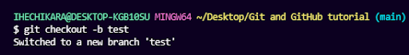

# A comprehensive guide to web development

This a documentation by the developers of GDSC MMCOE, Pune.

This is a document will provide a brief introduction to web development and technologies. By following through we intend to make you aware of several concepts related to web and internet while maintaining a simple language for everyone to comprehend.

## Chapters

1. [Introduction](#1-introduction)
2. [Basics](#2-basics)

    2.1 [HTML](#2.1-html)

    2.2 [CSS](#2.2-CSS)

    2.3 [JavaScript](#2.3-javascript)

    2.4 [Advanced JS](#2.4-advanced-js)

    2.5 [Data Validation](#2.5-data-validation)

3. [Responsive Web Design](#3-responsive-web-design)

4. [Libraries](#4-libraries)

5. [Web Architecture](#5-web-architecture)

6. [Frontend](#6-frontend)

7. [Backend](#7-backend)

8. [Database](#8-database)

9. [Authentication and Authorization](#9-authentication-and-authorization)

10. [Git and Github](#10-git-and-github)

## 1. Introduction

Web development is the process of creating websites and web applications. Think of a website as a house, and web development as the construction process. Just as a house needs a blueprint and a team of builders, a website needs a design and a team of developers.

There are three main areas of web development: front-end, back-end, and full-stack.

Front-end development focuses on the parts of a website that users interact with, such as the layout, colors, fonts, and buttons. It involves using programming languages like HTML, CSS, and JavaScript to create the visual and interactive elements of a website. An example of front-end development would be designing a website's homepage to look visually appealing and user-friendly.

Back-end development focuses on the parts of a website that users don't see, such as the server and database that store and process data. It involves using programming languages like PHP, Python, and Ruby to create the logic and functionality that power a website. An example of back-end development would be creating a system that allows users to log in to a website and store their account information securely.

Full-stack development involves working on both the front-end and back-end of a website or application. This means that a full-stack developer can create both the visual and interactive parts of a website as well as the behind-the-scenes logic and functionality. An example of full-stack development would be building a website from scratch, starting with the design and layout, and then adding the necessary programming to make it work smoothly and securely.

## 2. Basics

### 2.1 HTML

Lorem ipsum

### 2.2 CSS

content here

### 2.3 JavaScript

content here

### 2.4 Advanced JS

content here

### 2.5 Data Validation

content here

## 3. Responsive Web Design

hello

## 4. Libraries

## 5. Web Architecture

Web architecture refers to the underlying structure and organization of web-based systems and applications. It includes the technologies, protocols, and standards used to build, communicate, and interact with web-based resources such as websites, web applications, and web services.

At a high level, web architecture can be thought of as consisting of three primary components: client, server, and network. The client is typically a web browser or other application that requests resources from a server. The server is a computer system that responds to client requests by serving up web pages or other content. The network is the infrastructure that connects clients and servers together, allowing them to communicate.

One common example of web architecture is the classic client-server model. In this model, a web browser (the client) sends a request to a web server for a web page or other resource. The server processes the request and sends back a response, which the client then displays to the user. The two communicate using the HTTP protocol, which is a set of rules for transmitting data over the web.

Web architecture also encompasses various other technologies and standards, such as HTML (Hypertext Markup Language) for structuring web content, CSS (Cascading Style Sheets) for styling web pages, and JavaScript for adding interactivity to web applications. In addition, there are numerous web frameworks and libraries available that can simplify web development and make it more efficient.

## 6. Frontend

## 7. Backend

### What is backend, why is it required?

The term backend typically refers to the part of an application that handles the logic and data processing behind the scenes. This includes things like database management, server-side scripting etc.
A backend is required in many applications because it handles the logic and processing that is necessary to provide a complete and functional user experience. Here are a few examples of why a backend is needed in different types of applications:

1. E-commerce website: An e-commerce website requires a backend to handle the processing of orders, inventory management, and payment processing. When a user places an order on the website, the backend must manage the inventory to ensure that the product is available, process the payment securely, and generate an order confirmation for the user.

2. Social media platform: A social media platform requires a backend to manage user profiles, posts, and interactions. When a user creates a post, the backend must store the content and metadata associated with the post, and make it available to other users who have permission to view it.

3. Mobile app: A mobile app requires a backend to handle data synchronization, user authentication, and storage of user preferences. When a user uses a mobile app, the backend must ensure that the user's data is synchronized across devices, verify the user's identity, and store user preferences so they are available the next time the user uses the app.

### Let us understand how it works and how frontend interacts with backend

Before we do we need to see what HTTP methods are:
HTTP methods are a way for clients (such as web browsers) and servers to communicate with each other over the internet. HTTP stands for Hypertext Transfer Protocol, which is the protocol used for transmitting data over the web.

There are several HTTP methods, also known as HTTP verbs, that are used for different types of requests:

1. GET: Used to retrieve information from a server. When a user visits a website, their web browser sends a GET request to the server to retrieve the webpage.

2. POST: Used to submit information to a server, such as when filling out a form. When a user submits a form on a website, their web browser sends a POST request to the server with the form data.

3. PUT: Used to update or replace existing information on a server. For example, a PUT request could be used to update a user's profile information.

4. DELETE: Used to delete information from a server. For example, a DELETE request could be used to delete a user's account.

5. PATCH: Used to make a partial update to existing information on a server. For example, a PATCH request could be used to update only a specific field in a user's profile.

6. HEAD: Similar to a GET request, but only retrieves the headers of the response, not the body.

A sample http request will look like this

``` http
GET /example.html HTTP/1.1
Host: www.example.com
User-Agent: Mozilla/5.0 (Windows NT 10.0; Win64; x64) AppleWebKit/537.36 (KHTML, like Gecko) Chrome/80.0.3987.132 Safari/537.36
Accept: text/html,application/xhtml+xml,application/xml;q=0.9,image/webp,image/apng,*/*;q=0.8,application/signed-exchange;v=b3;q=0.9
```

Here first line is the method and url, the url is relative.

Next few values such as Host, User-Agent etc are the headers, headers are used to pass additional information and configuration data.

### Let’s see how a backend looks like in terms of a program

Without going to a specific language here is a pseudocode for a simple backend. It represenents the common structure of popular backend technology.

```bash
server = CreateServer()

server.handle(“/”, handleindex)

function handleindex(request, response){
 response.send(“index.html”)
} 

Server.listen()
```

Every server starts with initialization, in the above example `createServer` is the function that creates the server object

`Server.handle` is the function that binds the path "/" of the URL to the given function, here it is the `handleindex` function

Whenever someone will visit the path "/" the server will run the `handleindex` function.

This function receives two parameters
`request` and `response`

`request` is the request object which will contain information such as body, method, headers etc

This is where data sent from a frontend is found

`response` is the response object that function will send. We can put data and other fields in response and send it back to the frontend that calls the request.

Here we are sending index.html file to the frontend through response.

You may have guessed by now that this request is called by user webpage through browser hence, we send/render the html file.

GET method is usually used to request data from the server, GET is not very secure since the values passed through GET are visible in URL, example:
<http://example.com/search?q=hello>

Here q is passed to the server with value hello this is visible in URL, GET should never be used to send sensitive data.

It is used to request for data and information passed through GET should only be related to the data that is being retrieved.

POST,PUT and DELETE are typically used to send data to the server, neither of these methods show data in the URL but that does not make them secure automatically, one can still see the request body and find sensitive information.

You should always use HTTPS when sending sensitive information like passwords, keys etc.

APIs:
APIs stand for application programming interface. In simple terms it means that an API is a function or in case of web a URL that is used to communicate with applications.

A simple example of API in case of web is as follows:

<https://www.example.com/users>

This URL is an API. Which means that if we send a GET request then the server handling the URL will send back data to us.

Similarly if we send a POST request to that URL it will do some different action.

### RESTful APIs

REST stands for REpresentational State Transfer

REST is a design principle which states that a server should make use of 4 http methods for 4 purposes as follows:

1. GET: For retrieval of data
2. POST: To create new object or to add new data to the server
3. PUT/PATCH: To update data on the server
4. DELETE: To remove data from the server

REST is not just these 4 methods there are other principles that come within REST design.\
(see <https://restfulapi.net/>).

REST APIs are widely used for building web and mobile applications, as well as integrating different software systems.\
They provide a flexible and scalable way to transfer data between applications, making it easier to build complex systems and enable new types of interactions between different parts of an application or between different applications.

### What are some of the most popular backend languages?

There are many but lets take a brief look at a few:

1. __Nodejs__:\
NodeJs is a backend programming language that is based on JavaScript. It's used for creating web applications and server-side code. NodeJs is known for its fast performance, scalability, and non-blocking I/O operations. It's commonly used for creating real-time applications, such as chat applications, gaming platforms, and social media platforms.

2. __Python__:\
Python is a versatile programming language that is used for web development, scientific computing, data analysis, and machine learning. Python has a simple syntax and a large standard library, making it easy to learn and use. It's commonly used for backend web development, data processing, and automation tasks. Python is also popular in the machine learning and data science fields.

3. __Java__:\
Java is a popular programming language that is used for developing enterprise-level applications, including web applications and mobile applications. Java is known for its portability, security, and scalability. It's commonly used for backend web development, financial applications, and large-scale enterprise applications. Java is also popular in the Android mobile app development field.

4. __PHP__:\
PHP is a scripting language that is used for creating dynamic web pages and server-side code. It's commonly used for backend web development, content management systems, and e-commerce platforms. PHP has a large community and many frameworks and libraries, making it easy to learn and use. However, PHP has been criticized for its security issues and inconsistencies in its syntax.

Here is a tabular comparison of the above languages

<table>
  <thead>
    <tr>
      <th>Factor</th>
      <th>Python</th>
      <th>Node.js</th>
      <th>Java</th>
      <th>PHP</th>
    </tr>
  </thead>
  <tbody>
    <tr>
      <td>Performance</td>
      <td>Generally slower than Java, but fast enough for most use cases. Good for data science, machine learning, and scientific computing.</td>
      <td>Very fast due to its event-driven, non-blocking I/O model. Good for real-time applications, IoT, and microservices.</td>
      <td>Fast and efficient due to the JVM (Java Virtual Machine). Excellent for high-performance, large-scale applications.</td>
      <td>Generally slower than Java, but fast enough for most use cases. Good for web applications and content management systems.</td>
    </tr>
    <tr>
      <td>Scalability</td>
      <td>Good scalability, particularly with async/await and parallel processing.</td>
      <td>Good scalability due to non-blocking I/O and event-driven model.</td>
      <td>Excellent scalability due to the JVM and support for multi-threading.</td>
      <td>Average scalability due to lack of support for multi-threading.</td>
    </tr>
    <tr>
      <td>Language Features</td>
      <td>Supports multiple programming paradigms including procedural, object-oriented, and functional programming. Good for data manipulation, scientific computing, and web development.</td>
      <td>Supports asynchronous programming, event-driven model, and functional programming. Good for real-time applications, microservices, and IoT.</td>
      <td>Supports object-oriented programming, multi-threading, and strong typing. Good for large-scale applications and enterprise development.</td>
      <td>Supports procedural, object-oriented, and functional programming. Good for web development and content management systems.</td>
    </tr>
    <tr>
      <td>Security</td>
      <td>Good security features, but vulnerable to injection attacks, cross-site scripting, and code injection.</td>
      <td>Good security features, but vulnerable to injection attacks, cross-site scripting, and code injection.</td>
      <td>Excellent security features, with strong encryption and built-in security libraries.</td>
      <td>Good security features, but vulnerable to injection attacks, cross-site scripting, and code injection.</td>
    </tr>
    <tr>
      <td>Community Support</td>
      <td>Large and active community with many libraries, frameworks, and resources available. Good for web development, scientific computing, and machine learning.</td>
      <td>Large and active community with many libraries, frameworks, and resources available. Good for real-time applications, microservices, and IoT.</td>
      <td>Large and active community with many libraries, frameworks, and resources available. Good for enterprise development and large-scale applications.</td>
      <td>Large and active community with many libraries, frameworks, and resources available. Good for web development and content management systems.</td>
    </tr>
  </tbody>
</table>

There are many other factors that involve when you choose a backend technology like :- requirements, experience of developers, cost and time, maintenance etc.

Resources:

1. <https://restfulapi.net/>
2. <https://developer.mozilla.org/en-US/docs/Web/HTTP>
3. <https://wiki.python.org/moin/WebFrameworks>
4. <https://www.oracle.com/technical-resources/articles/javase/webapps-1.html>
5. <https://www.php.net/>
6. <https://nodejs.org/en/docs/guides/getting-started-guide/>

## 8. Database

## 9. Authentication and Authorization

## 10. Git and Github

If you're a beginner, you might think that these two terms mean the same thing - but they're different.

### what is git?

Git is a version control system which lets you track changes you make to your files over time. Git will create a backup of your files on command, and let you go back to every backup you create (like a time traveling machine). You can also make a complete copy of your files, make changes to that copy, and then merge these changes to the original copy.
For example, you could be working on a website's landing page and discover that you do not like the navigation bar. But at the same time, you might not want to start altering its components because it might get worse.

With Git, you can create an identical copy of the entire website code (called a branch) and play around with the navigation bar. Then, when you are satisfied with your changes, you can merge the copy to the original file.

You don't necessarily need to merge that copy, you can keep it entirely separate and make something different.

You are not limited to using Git just for source code files - you can also use it to keep track of text files or even images. This means that Git is not just for developers - anyone can find it helpful.

*Wow that sounds cool, how can I actually do it?*

Well to get started initialize your project, simply run

``` bash
git init
```

This will tell Git to get ready to start watching your files for every change that occurs. It looks like this:


*Ah okay so my files are tracked now? All good, right?*

Not really,

Git does not immediately start tracking every file and folder you give it. It will initially not track any files. git considers your files in an untracked state.

You will need to tell git what files to track using __add__ command

### How to add files in Git

To do that, we use this command

```bash
git add <filename>
```

After this git will add the file with the file name you provide it
If you want to add a file named __about.txt__, you will use

```bash
git add about.txt
```

But what if I want to add all files in the folder? Do I keep telling git each and every file??

No, you can tell git to add everything using

```bash
git add .
```

You can check it by using

``` bash
git status
```

It will tell you status of your files

This will put your files from __untracked__ to __staged__ state. '.' (dot) is short form for current directory.

*Oh no I accidentally added a file that I didn't mean to, what do I do?*
git on the rescue, just tell git to reset

```bash
git reset HEAD <filename>
```

### git commit

Now, about creating that backup of your files, you need to commit the files that you added using

```bash
git commit -m "commit message"
```


When you commit your files git creates a kind of checkpoint, now git has made a backup of your files, you can freely go wild and make breaking changes to your code. In the end you can just revert to this backup or any prior committed changes you made whenever you want.

There are different ways to revert to the latest committed state. You could use

``` bash
git stash
```

This will not only revert but also store your changes into a temporary stash

### Branches

Let's take a look at how to create those copies of your entire code using branches
To create a new branch, run this command:

``` bash
git checkout -b <branch name>
```


This will create a new branch, a complete copy of your code.
It will also replace your current folder to show you contents of this branch.

*Okay, but what happened to my original copy? Is it gone?*

Nope, your original copy is under the branch name master, when you initialize git repository it creates a master branch and uses it as default

You can switch to your master branch using

```bash
git checkout master
```

Notice it's the same command that we used to create a new branch, the only difference is that we are not giving it -b. As you guessed correctly, the -b is used to tell git to create a new branch  

*I made a cool change in the test branch, tested a few things and I have decided to have those changes into the master branch.*

Simply checkout master branch and tell git to merge:

```bash
git merge test
```

It will merge those changes into the master branch


<br>
<br>
<br>

### What is Github

GitHub is an online hosting service for Git repositories. Imagine working on a project at home and while you are away, maybe at a friend's place, you suddenly remember the solution to a code error that has kept you restless for days.

You cannot make these changes because your PC is not with you. But if you have your project hosted on GitHub, you can access and download that project with a command on whatever computer you have access to. Then you can make your changes and push the latest version back to GitHub.In summary, GitHub lets you store your repo on their platform. Another awesome feature that comes with GitHub is the ability to collaborate with other developers from any location.Now that we have created and initialized our project locally, let's push it to GitHub.If you are a beginner, you will come across some new terms like push, commit, add, and so on - but do not be overwhelmed by them. With some practice you will be able to remember these terms and what they do.
<br>
<br>

### How to push a repository to GitHub

Step 1 - Create a GitHub account

Step 2 - Create a repository on github

To push your current repository to github you will need to authenticate with your github account
TODO: PUT AUTHENTICATION STEPS

You have an option to change your default branch name when you are uploading your repository the first time.
You can do that by

```bash
git branch -M <branch name>
```

TODO: PUT GIT REMOTE ADD ORIGIN STEPS AND EXPLANATION

Now make sure you have added and committed your files using git
Once you are done use the command:

```bash
git push origin <branch-name>
```

Here you tell git that you want to push these changes to your remote that you named as origin in the previous steps and you tell git that you would like to push the given branch \<branch-name\>

You can check your github repository and you will see your files there.


### How to pull changes

Suppose you are working with a friend on a project and you are collaborating on github,
Your friend makes changes and pushes them to the github repository, but you don't have those changes on your computer.
To update the changes you can use:

```bash
git pull origin <branch-name>
```

This will update changes made to the branch \<branch-name\>

### How to Clone a repository

Suppose you see someone's code you like and want to use it and see it run for yourself. git provides a easy way to have a repository cloned for you

```bash
 git clone REPOSITORY_HTTPS_URL
 ```

This command downloads the remote repository into your local computer in a folder with the name of the repository.


<br>

If you have followed up to this point then congratulations, you are good to go.You can now use Git in your projects no matter what programming language you are using. But this is not the end, git is much more than this. These steps you saw are the basics that you will be using most commonly, but we encourage you to find and learn more about features of git using the resources below.

<br>

## Resources:-

1. <https://www.freecodecamp.org/news/git-and-github-for-beginners/>
2. <https://www.freecodecamp.org/news/how-to-use-basic-git-and-github-commands/>
3. <https://www.youtube.com/watch?v=RGOj5yH7evk>
4. <https://www.freecodecamp.org/news/what-is-git-and-how-to-use-it-c341b049ae61/>
5. <https://github.com/about>
